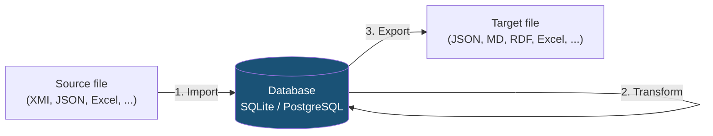

# Guide

This guide describes how to install and use crunch_uml for importing, transforming and exporting UML models.

## Workflow

crunch_uml works in three steps that you can use independently of each other:

1. **Import** — Read a UML model from a source file and save it to the database
2. **Transform** — Copy or edit the model within the database (optional)
3. **Export** — Generate output in the desired format

Each command works on a **schema** in the database. Schemas are logical separations that allow you to keep multiple versions or variants of a model side by side.

## Pages

- [Installation](installatie.md) — Installation and first use
- [Import](import.md) — Reading models
- [Transform](transform.md) — Transforming models
- [Export](export.md) — Exporting models
- [CLI Reference](cli-referentie.md) — Complete overview of all options
