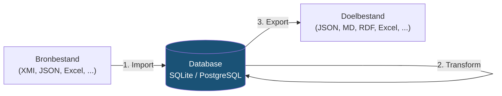

# Handleiding

Deze handleiding beschrijft hoe je crunch_uml installeert en gebruikt voor het importeren, transformeren en exporteren van UML-modellen.

## Werkwijze

crunch_uml werkt in drie stappen die je onafhankelijk van elkaar kunt gebruiken:

1. **Import** — Lees een UML-model in vanuit een bronbestand en sla het op in de database
2. **Transform** — Kopieer of bewerk het model binnen de database (optioneel)
3. **Export** — Genereer output in het gewenste formaat

Elk commando werkt op een **schema** in de database. Schema's zijn logische scheidingen waarmee je meerdere versies of varianten van een model naast elkaar kunt bewaren.

## Pagina's

- [Installatie](installatie.md) — Installatie en eerste gebruik
- [Import](import.md) — Modellen inlezen
- [Transform](transform.md) — Modellen transformeren
- [Export](export.md) — Modellen exporteren
- [CLI-referentie](cli-referentie.md) — Compleet overzicht van alle opties
