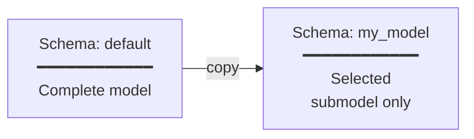

# Transform

The `transform` command copies or edits a model within the database, from one schema to another. This is crucial for working with submodels, version control and multilinguality.

## Basic Syntax

```bash
crunch_uml transform -ttp <type> -sch_to <target_schema> [options]
```

## Transformation Types

| Type | Option `-ttp` | Description |
|---|---|---|
| Copy | `copy` | Deep copy of a package hierarchy to another schema |
| Plugin | `plugin` | Custom transformation via a dynamically loaded plugin |

## Options

| Option | Description |
|---|---|
| `-sch_from` | Source schema (default: `default`) |
| `-sch_to` | Target schema (required) |
| `-sch_to_cln` | Clean the target schema first |
| `-ttp, --transformationtype` | Type: `copy` or `plugin` |
| `-rt_pkg, --root_package` | ID of the root package to be copied |
| `-m_gen, --materialize_generalizations` | Copy attributes from superclasses to subclasses |
| `-plug_mod, --plugin_file_name` | Path to plugin Python file |
| `-plug_cl, --plugin_class_name` | Class name of the plugin |

## Copy Transformer

The copy transformer makes a deep copy of a package hierarchy (including all classes, attributes, associations, enumerations and generalizations) from one schema to another.



### Example: Copy submodel

```bash
# Copy only the package with ID EAPK_12345 to schema "submodel"
crunch_uml transform -ttp copy -sch_to submodel -rt_pkg EAPK_12345
```

### Example: Flatten inheritance

With `--materialize_generalizations` attributes from superclasses are copied to subclasses. This is useful when you need a "flat" model, for example for generating database tables.

```bash
crunch_uml transform -ttp copy -sch_to flat_model -rt_pkg EAPK_12345 \
    -m_gen True
```

## Plugin Transformer

For custom transformations you can write your own Python plugin:

```bash
crunch_uml transform -ttp plugin \
    -plug_mod /path/to/my_plugin.py \
    -plug_cl MyTransformation \
    -sch_to result
```

The plugin class must extend `crunch_uml.transformers.plugin.Plugin`:

```python
from crunch_uml.transformers.plugin import Plugin

class MyTransformation(Plugin):
    def transform(self, args, schema_from, schema_to):
        # Read data from schema_from
        # Edit and write to schema_to
        ...
```

## Typical Workflows

### Prepare version comparison

```bash
# 1. Import current version
crunch_uml import -f model_v2.xmi -t eaxmi -db_create

# 2. Copy to a named schema
crunch_uml transform -ttp copy -sch_to current_version -rt_pkg ROOT_ID

# 3. Import previous version in another schema
crunch_uml -sch previous_raw import -f model_v1.xmi -t eaxmi

# 4. Copy that as well to a named schema
crunch_uml transform -ttp copy -sch_from previous_raw -sch_to previous_version -rt_pkg ROOT_ID

# 5. Now you can generate a diff (see Export)
```

### Build multilingual model

```bash
# 1. Import and copy the base model
crunch_uml import -f model.xmi -t eaxmi -db_create
crunch_uml transform -ttp copy -sch_to translation_en -rt_pkg ROOT_ID

# 2. Import English translations into that schema
crunch_uml -sch translation_en import -f translations_en.json -t i18n --language en
```
