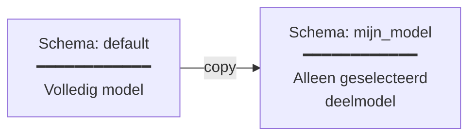

# Transform

Het `transform`-commando kopieert of bewerkt een model binnen de database, van het ene schema naar het andere. Dit is cruciaal voor het werken met deelmodellen, versiebeheer en meertaligheid.

## Basissyntax

```bash
crunch_uml transform -ttp <type> -sch_to <doelschema> [opties]
```

## Transformatietypen

| Type | Optie `-ttp` | Beschrijving |
|---|---|---|
| Copy | `copy` | Deep copy van een package-hiërarchie naar een ander schema |
| Plugin | `plugin` | Custom transformatie via een dynamisch geladen plugin |

## Opties

| Optie | Beschrijving |
|---|---|
| `-sch_from` | Bronschema (standaard: `default`) |
| `-sch_to` | Doelschema (verplicht) |
| `-sch_to_cln` | Maak het doelschema eerst leeg |
| `-ttp, --transformationtype` | Type: `copy` of `plugin` |
| `-rt_pkg, --root_package` | ID van het root-package dat gekopieerd moet worden |
| `-m_gen, --materialize_generalizations` | Kopieer attributen van superklassen naar subklassen |
| `-plug_mod, --plugin_file_name` | Pad naar plugin Python-bestand |
| `-plug_cl, --plugin_class_name` | Klassenaam van de plugin |

## Copy Transformer

De copy transformer maakt een diepe kopie van een package-hiërarchie (inclusief alle classes, attributen, associaties, enumeraties en generalisaties) van het ene schema naar het andere.



### Voorbeeld: deelmodel kopiëren

```bash
# Kopieer alleen het package met ID EAPK_12345 naar schema "deelmodel"
crunch_uml transform -ttp copy -sch_to deelmodel -rt_pkg EAPK_12345
```

### Voorbeeld: inheritance afvlakken

Met `--materialize_generalizations` worden attributen van superklassen gekopieerd naar subklassen. Dit is handig wanneer je een "plat" model nodig hebt, bijvoorbeeld voor het genereren van database-tabellen.

```bash
crunch_uml transform -ttp copy -sch_to plat_model -rt_pkg EAPK_12345 \
    -m_gen True
```

## Plugin Transformer

Voor custom transformaties kun je een eigen Python-plugin schrijven:

```bash
crunch_uml transform -ttp plugin \
    -plug_mod /pad/naar/mijn_plugin.py \
    -plug_cl MijnTransformatie \
    -sch_to resultaat
```

De plugin-klasse moet `crunch_uml.transformers.plugin.Plugin` extenden:

```python
from crunch_uml.transformers.plugin import Plugin

class MijnTransformatie(Plugin):
    def transform(self, args, schema_from, schema_to):
        # Lees data uit schema_from
        # Bewerk en schrijf naar schema_to
        ...
```

## Typische workflows

### Versievergelijking voorbereiden

```bash
# 1. Importeer huidige versie
crunch_uml import -f model_v2.xmi -t eaxmi -db_create

# 2. Kopieer naar een benoemd schema
crunch_uml transform -ttp copy -sch_to huidige_versie -rt_pkg ROOT_ID

# 3. Importeer vorige versie in ander schema
crunch_uml -sch vorige_raw import -f model_v1.xmi -t eaxmi

# 4. Kopieer ook die naar benoemd schema
crunch_uml transform -ttp copy -sch_from vorige_raw -sch_to vorige_versie -rt_pkg ROOT_ID

# 5. Nu kun je een diff genereren (zie Export)
```

### Meertalig model opbouwen

```bash
# 1. Importeer en kopieer het basismodel
crunch_uml import -f model.xmi -t eaxmi -db_create
crunch_uml transform -ttp copy -sch_to vertaling_en -rt_pkg ROOT_ID

# 2. Importeer Engelse vertalingen in dat schema
crunch_uml -sch vertaling_en import -f translations_en.json -t i18n --language en
```
