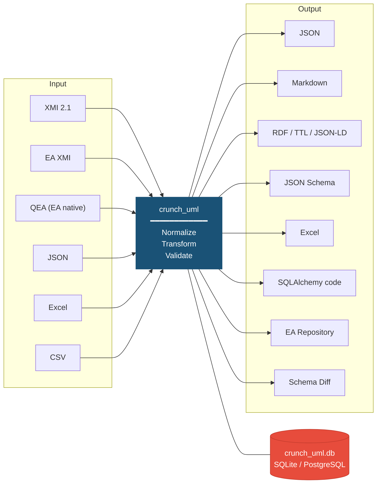

# crunch_uml

## The Problem: Incompatible UML Exchange Formats

UML models are essential for designing information systems, but in practice exchanging these models is a persistent problem. Although XMI (XML Metadata Interchange) was once intended as a universal exchange format, the reality is different: Enterprise Architect exports XMI with proprietary extensions that other tools don't understand, Sparx Systems has introduced its own QEA format alongside XMI, and tools like Visual Paradigm and MagicDraw produce yet other variants. On top of that, organizations in practice work with Excel sheets, JSON files and CSV exports to share model information.

The result: models created in one system cannot simply be read into another system. Organizations working with multiple tools or chain partners continuously encounter incompatibilities. Manual conversion is time-consuming and error-prone.

## The Solution: crunch_uml

**crunch_uml** solves this by functioning as a universal intermediary. It can read UML models from virtually any common format, store them in a normalized database, transform them, and export them again to the desired target format.



The core of crunch_uml is a **standardized meta-schema**: regardless of the input format, all UML entities (packages, classes, attributes, associations, generalizations, enumerations) are stored in the same database. From that database you can then export to any desired format.

## What Makes crunch_uml Special?

**Multi-schema support** — You can read the same model multiple times into different schemas within the same database. This allows you to, for example, place version 1.0 and version 2.0 of a model side by side and automatically generate a diff report. Or you can keep a translated model alongside the original.

**Plugin architecture** — New input formats, output formats and transformations can be added without modifying the core code, via a registry-based plugin system.

**Pipeline approach** — Import, transformation and export are independent steps that you can combine as needed into automated workflows.

## Quick Start

```bash
pip install crunch-uml

# Import an Enterprise Architect XMI file
crunch_uml import -f model.xmi -t eaxmi -db_create

# Copy a submodel to a separate schema
crunch_uml transform -ttp copy -sch_to my_model -rt_pkg EAPK_12345

# Export to Excel
crunch_uml -sch my_model export -t xlsx -f model.xlsx
```

See the [Guide](handleiding/index.md) for extensive documentation, or the [Examples](voorbeelden.md) for concrete workflows.

## Documentation

| Section | Content |
|---|---|
| [Guide](handleiding/index.md) | Installation, import, transform, export and CLI reference |
| [Examples](voorbeelden.md) | Concrete workflows from practice |
| [Technical Design](technisch/index.md) | Architecture, components, data model, vulnerabilities, roadmap |

## Editing Documentation

This site runs on [MkDocs](https://www.mkdocs.org/) with the [Material](https://squidfunk.github.io/mkdocs-material/) theme. Diagrams are [Mermaid](https://mermaid.js.org/) and are rendered live. Images are clickable to enlarge (via [glightbox](https://github.com/blueswen/mkdocs-glightbox)).

```bash
pip install mkdocs-material mkdocs-glightbox
mkdocs serve          # preview at http://localhost:8000
mkdocs build          # generate static site
```
