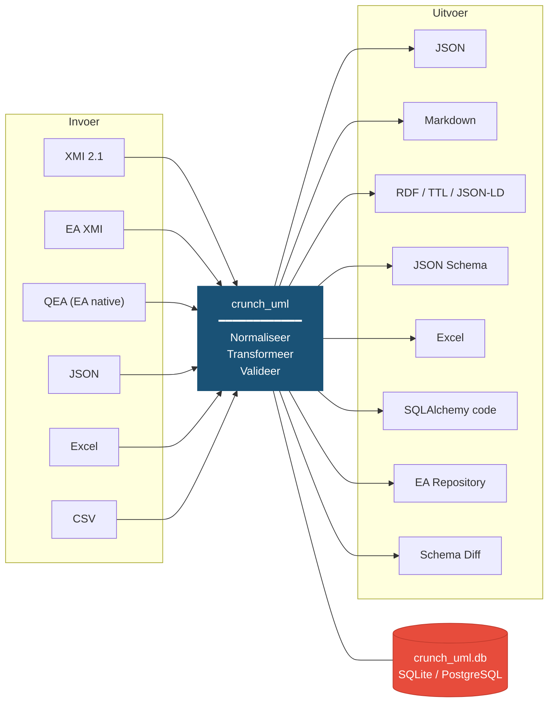

# crunch_uml

## Het probleem: incompatibele UML-uitwisselformaten

UML-modellen zijn essentieel voor het ontwerpen van informatiesystemen, maar in de praktijk is het uitwisselen van deze modellen een hardnekkig probleem. Hoewel XMI (XML Metadata Interchange) ooit bedoeld was als universeel uitwisselformaat, is de realiteit anders: Enterprise Architect exporteert XMI met eigen extensies die andere tools niet begrijpen, Sparx Systems heeft naast XMI een eigen QEA-formaat geïntroduceerd, en tools als Visual Paradigm en MagicDraw produceren weer andere varianten. Daarbovenop werken organisaties in de praktijk met Excel-sheets, JSON-bestanden en CSV-exports om modelinformatie te delen.

Het resultaat: modellen die in het ene systeem zijn gemaakt kunnen niet zomaar in een ander systeem worden ingelezen. Organisaties die met meerdere tools of ketenpartners werken lopen continu tegen incompatibiliteiten aan. Handmatige conversie is tijdrovend en foutgevoelig.

## De oplossing: crunch_uml

**crunch_uml** lost dit op door als universele tussenstap te fungeren. Het kan UML-modellen inlezen uit vrijwel elk gangbaar formaat, deze opslaan in een genormaliseerde database, transformeren, en weer exporteren naar het gewenste doelformaat.



De kern van crunch_uml is een **gestandaardiseerd metaschema**: ongeacht het invoerformaat worden alle UML-entiteiten (packages, classes, attributen, associaties, generalisaties, enumeraties) opgeslagen in dezelfde database. Vanuit die database kun je vervolgens exporteren naar elk gewenst formaat.

## Wat maakt crunch_uml bijzonder?

**Multi-schema ondersteuning** — Je kunt hetzelfde model meerdere keren inlezen in verschillende schema's binnen dezelfde database. Hierdoor kun je bijvoorbeeld versie 1.0 en versie 2.0 van een model naast elkaar zetten en automatisch een diff-rapport genereren. Of je kunt een vertaald model naast het origineel bewaren.

**Plugin-architectuur** — Nieuwe invoerformaten, uitvoerformaten en transformaties kunnen worden toegevoegd zonder de kerncode aan te passen, via een registry-based plugin systeem.

**Pipeline-aanpak** — Import, transformatie en export zijn onafhankelijke stappen die je naar wens kunt combineren tot geautomatiseerde workflows.

## Snel starten

```bash
pip install crunch-uml

# Importeer een Enterprise Architect XMI-bestand
crunch_uml import -f model.xmi -t eaxmi -db_create

# Kopieer een deelmodel naar een apart schema
crunch_uml transform -ttp copy -sch_to mijn_model -rt_pkg EAPK_12345

# Exporteer naar Excel
crunch_uml -sch mijn_model export -t xlsx -f model.xlsx
```

Zie de [Handleiding](handleiding/index.md) voor uitgebreide documentatie, of de [Voorbeelden](voorbeelden.md) voor concrete workflows.

## Documentatie

| Sectie | Inhoud |
|---|---|
| [Handleiding](handleiding/index.md) | Installatie, import, transform, export en CLI-referentie |
| [Voorbeelden](voorbeelden.md) | Concrete workflows uit de praktijk |
| [Technisch Ontwerp](technisch/index.md) | Architectuur, componenten, datamodel, kwetsbaarheden, roadmap |

## Documentatie bewerken

Deze site draait op [MkDocs](https://www.mkdocs.org/) met het [Material](https://squidfunk.github.io/mkdocs-material/) thema. Diagrammen zijn [Mermaid](https://mermaid.js.org/) en worden live gerenderd. Afbeeldingen zijn klikbaar om ze te vergroten (via [glightbox](https://github.com/blueswen/mkdocs-glightbox)).

```bash
pip install mkdocs-material mkdocs-glightbox
mkdocs serve          # preview op http://localhost:8000
mkdocs build          # statische site genereren
```
