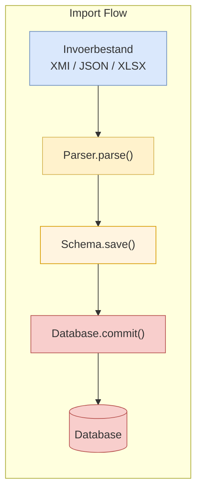
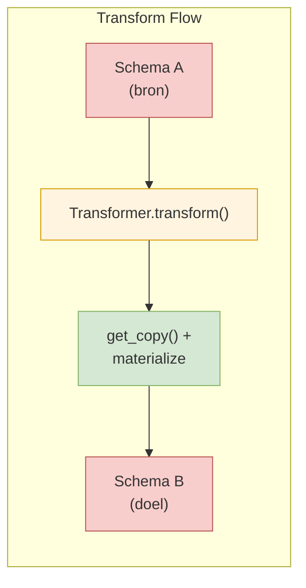
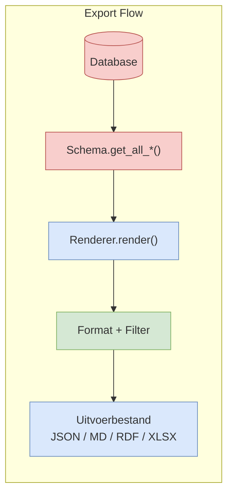
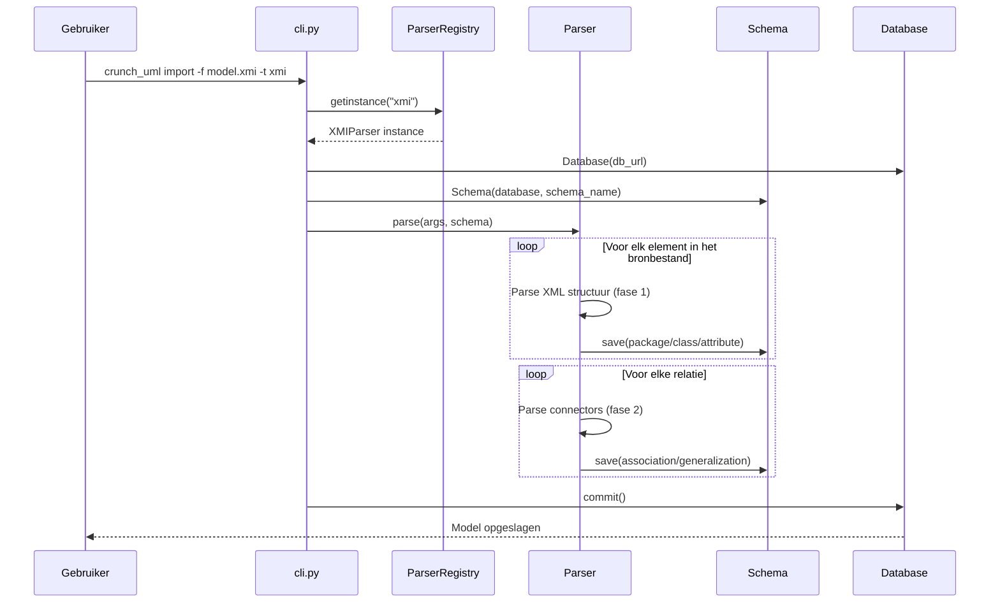
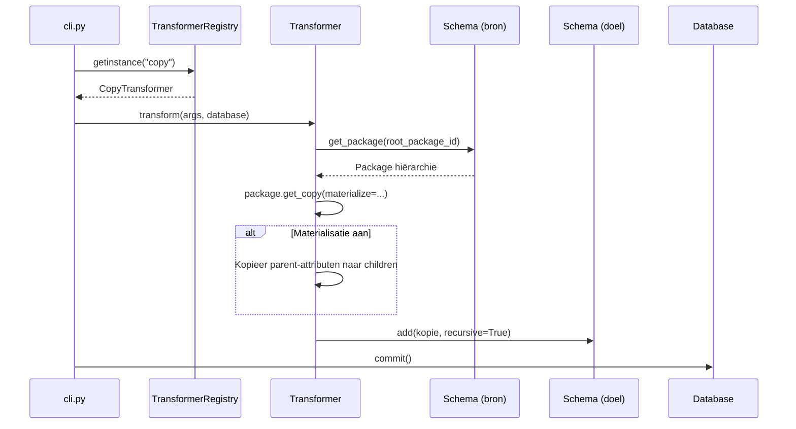
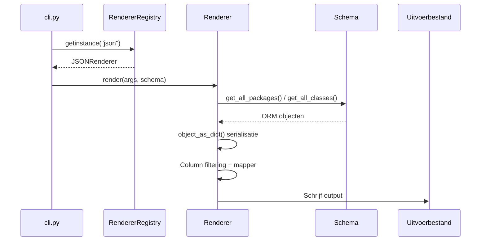
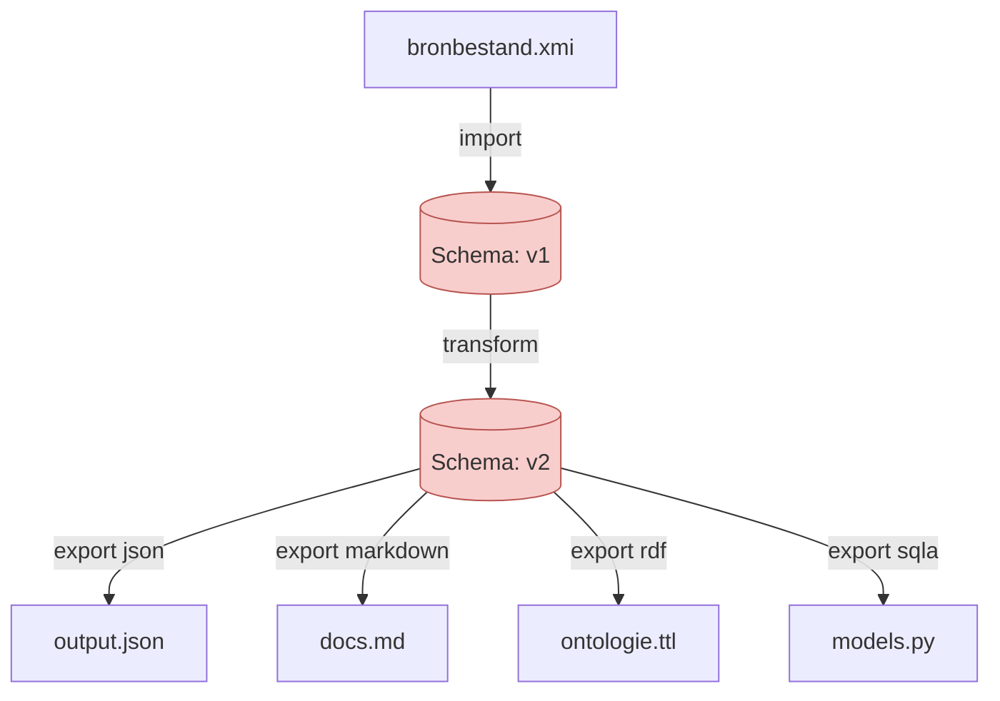

# Dataflows

## Overzicht

crunch_uml kent drie primaire dataflows die corresponderen met de drie CLI-commando's.

---

## Import Flow — Detail

De XMI-parser werkt in twee fasen:

1. **Fase 1** — `phase1_process_packages_classes()`: extraheert packages, classes, attributes en enumerations uit de XML-boom
2. **Fase 2** — `phase2_process_connectors()`: verwerkt associaties, generalisaties en diagramrelaties die refereren aan de in fase 1 aangemaakte objecten

---

## Transform Flow — Detail

---

## Export Flow — Detail

---

## Volledige Pipeline

Een typische pipeline combineert meerdere commando's:

