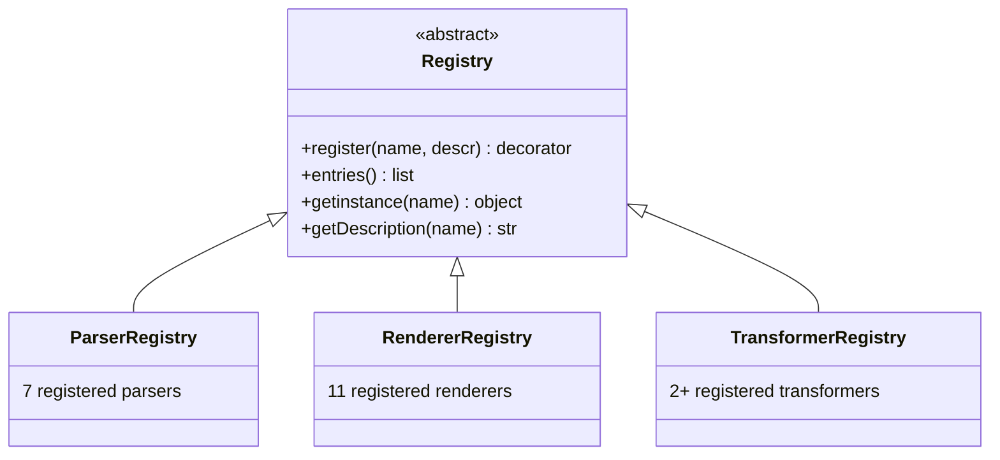
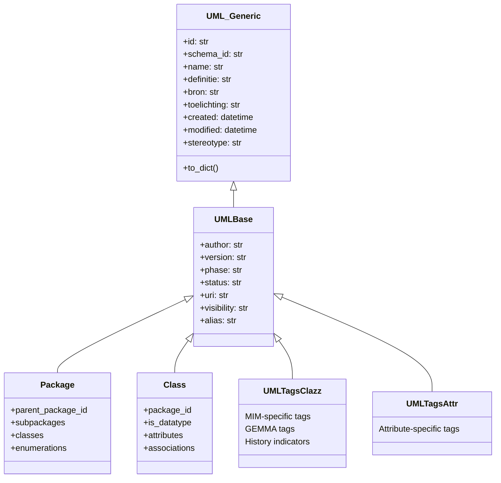
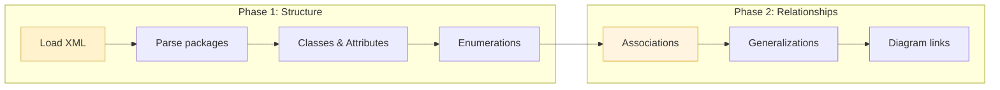

# Design Patterns

crunch_uml uses a number of recognizable design patterns that determine the extensibility and maintainability of the system.

## Registry Pattern

The central pattern of crunch_uml. All parsers, renderers and transformers are registered via decorators and are queryable via a uniform interface.



**Advantage**: new implementations can be added without modifying existing code — only a `@register` decorator is needed.

---

## Singleton Pattern

The `Database` class uses a singleton with `_instance` class variable. This guarantees one active database connection per process.

```python
class Database:
    _instance = None

    def __new__(cls, db_url, db_create=False):
        if cls._instance is None:
            cls._instance = super().__new__(cls)
            # Initialize engine + session
        return cls._instance
```

!!! warning "Note"
    The singleton pattern is problematic with multi-threaded or concurrent usage. See [Vulnerabilities](../kwetsbaarheden.md#singleton-database-pattern).

---

## Mixin Pattern

Reusable field definitions are composed via mixins. This prevents duplication across the ORM models.



---

## Two-Phase Parsing

XMI parsers process source files in two phases to resolve forward references:



Phase 1 creates all entities, phase 2 establishes relationships between them. This is necessary because XMI files can define relationships before the related entities appear in the document.

---

## Template Method Pattern

Parser, Renderer and Transformer base classes define the interface; subclasses implement the specific logic.

```python
class Renderer(ABC):
    @abstractmethod
    def render(self, args, schema):
        """Subclasses implement this."""
        pass

class ModelRenderer(Renderer):
    def getModels(self, args, schema):
        """Shared logic for model retrieval."""
        ...
```

---

## Decorator Pattern

The `@register` decorator combines class registration with the Registry:

```python
@ParserRegistry.register("xmi", descr="Standard XMI 2.1 parser")
class XMIParser(Parser):
    def parse(self, args, schema):
        ...
```

This makes adding a new parser a matter of:

1. Creating a new class that extends `Parser`
2. Adding the `@ParserRegistry.register("name")` decorator
3. Implementing the `parse()` method
