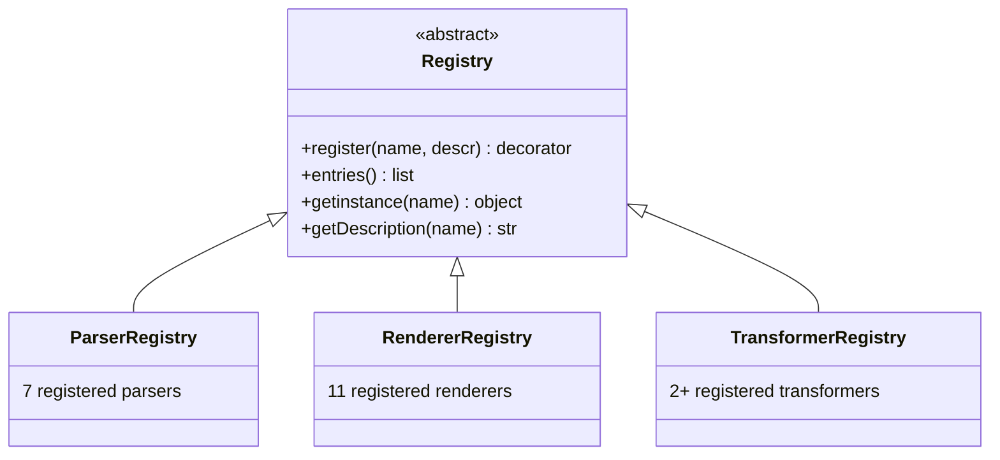
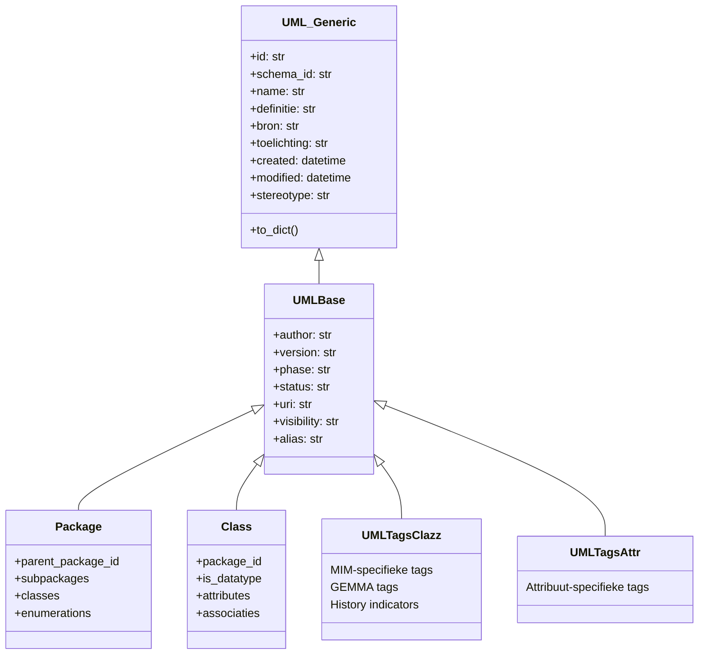
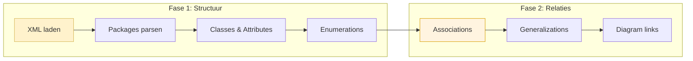

# Design Patterns

crunch_uml maakt gebruik van een aantal herkenbare design patterns die de uitbreidbaarheid en onderhoudbaarheid van het systeem bepalen.

## Registry Pattern

Het centrale pattern van crunch_uml. Alle parsers, renderers en transformers worden geregistreerd via decorators en zijn opvraagbaar via een uniforme interface.



**Voordeel**: nieuwe implementaties toevoegen zonder bestaande code aan te passen — alleen een `@register` decorator nodig.

---

## Singleton Pattern

De `Database` klasse gebruikt een singleton met `_instance` class variable. Dit garandeert één actieve databaseverbinding per proces.

```python
class Database:
    _instance = None

    def __new__(cls, db_url, db_create=False):
        if cls._instance is None:
            cls._instance = super().__new__(cls)
            # Initialiseer engine + session
        return cls._instance
```

!!! warning "Aandachtspunt"
    Het singleton pattern is problematisch bij multi-threaded of concurrent gebruik. Zie [Kwetsbaarheden](../kwetsbaarheden.md#singleton-database-pattern).

---

## Mixin Pattern

Herbruikbare velddefinities worden gecomponeerd via mixins. Dit voorkomt duplicatie over de ORM-modellen.



---

## Two-Phase Parsing

XMI-parsers verwerken bronbestanden in twee fasen om forward-referencing op te lossen:



Fase 1 creëert alle entiteiten, fase 2 legt relaties ertussen aan. Dit is nodig omdat XMI-bestanden relaties kunnen definiëren voordat de gerelateerde entiteiten in het document voorkomen.

---

## Template Method Pattern

Parser, Renderer en Transformer base classes definiëren de interface; subklassen implementeren de specifieke logica.

```python
class Renderer(ABC):
    @abstractmethod
    def render(self, args, schema):
        """Subklassen implementeren dit."""
        pass

class ModelRenderer(Renderer):
    def getModels(self, args, schema):
        """Gedeelde logica voor model-ophalen."""
        ...
```

---

## Decorator Pattern

De `@register` decorator combineert klasse-registratie met de Registry:

```python
@ParserRegistry.register("xmi", descr="Standard XMI 2.1 parser")
class XMIParser(Parser):
    def parse(self, args, schema):
        ...
```

Dit maakt het toevoegen van een nieuwe parser een kwestie van:

1. Nieuwe klasse aanmaken die `Parser` extend
2. `@ParserRegistry.register("naam")` decorator toevoegen
3. De `parse()` methode implementeren
