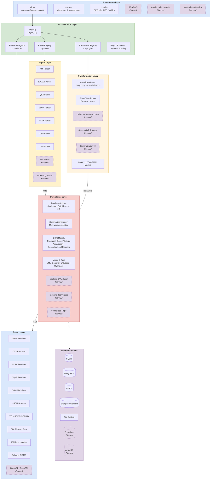

# Architecture Overview

## Layer Model

crunch_uml is built from six layers, from user interaction to external storage. Each layer has a clear responsibility and communicates only with directly adjacent layers.



!!! info "Legend"
    - **Solid lines** = Implemented components
    - **Dashed lines (purple)** = Planned components
    - Colors per layer: blue (presentation/export), green (orchestration), yellow (import), orange (transformation), red (persistence), purple (external)

## Directory Structure

```
crunch_uml/
├── __init__.py                 # Package entry point
├── cli.py                      # CLI argument parser & main()
├── const.py                    # Constants, mappings, configuration
├── db.py                       # Database models & Database class (1200+ lines)
├── schema.py                   # Schema wrapper for database operations
├── registry.py                 # Plugin registry pattern base class
├── lang.py                     # Translation module
├── util.py                     # Helper utilities
├── exceptions.py               # Custom exceptions
├── parsers/
│   ├── parser.py               # Parser base class & registry
│   ├── xmiparser.py            # Standard XMI parser
│   ├── eaxmiparser.py          # Enterprise Architect XMI parser
│   ├── qeaparser.py            # QEA format parser
│   └── multiple_parsers.py     # JSON, CSV, XLSX, i18n parsers
├── renderers/
│   ├── renderer.py             # Renderer base class & registry
│   ├── pandasrenderer.py       # JSON, CSV, i18n renderers
│   ├── xlsxrenderer.py         # Excel renderer
│   ├── jinja2renderer.py       # Jinja2, GGM_MD, JSON-Schema renderers
│   ├── lodrenderer.py          # TTL, RDF, JSON-LD renderers
│   ├── sqlarenderer.py         # SQLAlchemy model generator
│   └── earepoupdater.py        # EA repo updater
├── transformers/
│   ├── transformer.py          # Transformer base class & registry
│   ├── copytransformer.py      # Copy/clone transformer
│   ├── plugintransformer.py    # Plugin-based custom transformers
│   └── plugin.py               # Plugin base class
└── templates/                  # Jinja2 templates
    ├── ggm_markdown.j2
    ├── json_schema.j2
    ├── ddas_markdown.j2
    ├── ggm_sqlalchemy.j2
    └── json_datatypes.json
```

## Core Principles

1. **Registry-driven extensibility** — New parsers, renderers and transformers are registered via `@register` decorators, without modification of existing code
2. **Multi-schema isolation** — Multiple versions of the same model in one database, isolated via `schema_id`
3. **Pipeline architecture** — Import → Transform → Export as separate, composable steps
4. **Plugin framework** — Custom transformations via dynamically loaded plugins
