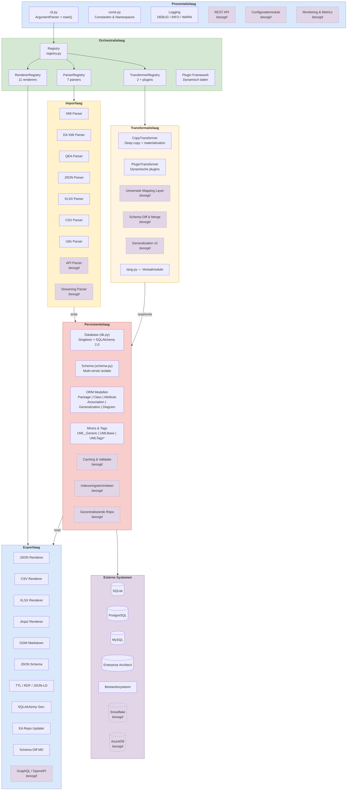

# Architectuuroverzicht

## Lagenmodel

crunch_uml is opgebouwd uit zes lagen, van gebruikersinteractie tot externe opslag. Elke laag heeft een duidelijke verantwoordelijkheid en communiceert alleen met direct aangrenzende lagen.



!!! info "Legenda"
    - **Doorgetrokken lijnen** = gerealiseerde componenten
    - **Gestreepte lijnen (paars)** = beoogde componenten
    - Kleuren per laag: blauw (presentatie/export), groen (orchestratie), geel (import), oranje (transformatie), rood (persistentie), paars (extern)

## Directorystructuur

```
crunch_uml/
├── __init__.py                 # Package entry point
├── cli.py                      # CLI argument parser & main()
├── const.py                    # Constanten, mappings, configuratie
├── db.py                       # Database modellen & Database klasse (1200+ regels)
├── schema.py                   # Schema wrapper voor database-operaties
├── registry.py                 # Plugin registry pattern base class
├── lang.py                     # Vertaalmodule
├── util.py                     # Helper utilities
├── exceptions.py               # Custom exceptions
├── parsers/
│   ├── parser.py               # Parser base class & registry
│   ├── xmiparser.py            # Standaard XMI parser
│   ├── eaxmiparser.py          # Enterprise Architect XMI parser
│   ├── qeaparser.py            # QEA format parser
│   └── multiple_parsers.py     # JSON, CSV, XLSX, i18n parsers
├── renderers/
│   ├── renderer.py             # Renderer base class & registry
│   ├── pandasrenderer.py       # JSON, CSV, i18n renderers
│   ├── xlsxrenderer.py         # Excel renderer
│   ├── jinja2renderer.py       # Jinja2, GGM_MD, JSON-Schema renderers
│   ├── lodrenderer.py          # TTL, RDF, JSON-LD renderers
│   ├── sqlarenderer.py         # SQLAlchemy model generator
│   └── earepoupdater.py        # EA repo updater
├── transformers/
│   ├── transformer.py          # Transformer base class & registry
│   ├── copytransformer.py      # Copy/clone transformer
│   ├── plugintransformer.py    # Plugin-based custom transformers
│   └── plugin.py               # Plugin base class
└── templates/                  # Jinja2 templates
    ├── ggm_markdown.j2
    ├── json_schema.j2
    ├── ddas_markdown.j2
    ├── ggm_sqlalchemy.j2
    └── json_datatypes.json
```

## Kernprincipes

1. **Registry-driven uitbreidbaarheid** — Nieuwe parsers, renderers en transformers worden geregistreerd via `@register` decorators, zonder aanpassing van bestaande code
2. **Multi-schema isolatie** — Meerdere versies van hetzelfde model in één database, geïsoleerd via `schema_id`
3. **Pipeline-architectuur** — Import → Transform → Export als losse, composable stappen
4. **Plugin framework** — Custom transformaties via dynamisch geladen plugins
