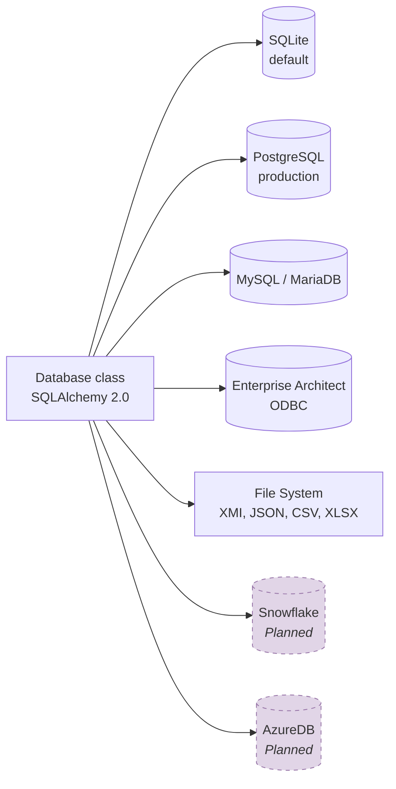

# Layer Details

## Layer 1: Presentation Layer

The presentation layer forms the contact point with the user and handles command processing, logging, and configuration.

### cli.py — Command Line Interface

Main entrypoint registered as `crunch_uml` console script. Provides three subcommands:

```bash
crunch_uml [-v] [-d] [-w] [-db_url URL] [-sch SCHEMA] {import,transform,export} ...
```

| Argument | Description |
|---|---|
| `-v / --verbose` | INFO-level logging |
| `-d / --debug` | DEBUG-level logging |
| `-db_url` | Database connection string |
| `-sch / --schema_name` | Name of the working schema |

The `main()` function validates arguments, configures logging, and delegates to the appropriate registry based on the command.

### const.py — Constants

Contains database URL defaults, XML namespaces (XMI 2.0.1, UML 2.0.1), command constants, EA Repository mappers, tag profiles, and language configuration.

### Planned Extensions

!!! note "REST API Interface"
    FastAPI or Flask-based web interface for controlling import/transform/export via HTTP.

!!! note "Configuration Module"
    Overarching interface for managing transformation pipelines, including monitoring and reproducibility.

---

## Layer 2: Orchestration Layer

The orchestration layer manages the registry pattern and plugin framework.

### Registry Pattern

```python
class Registry:
    @classmethod
    def register(name, descr="")   # Decorator for registration

    @classmethod
    def entries()                   # List of registered names

    @classmethod
    def getinstance(name)           # Instantiate registered class

    @classmethod
    def getDescription(name)        # Get description
```

Three subclasses implement this pattern:

| Registry | Count | Function |
|---|---|---|
| `ParserRegistry` | 7 | Maps input types to parser classes |
| `RendererRegistry` | 11 | Maps output types to renderer classes |
| `TransformerRegistry` | 2+ | Maps transformation types to transformer classes |

### Plugin Framework

Dynamic loading of custom transformation plugins via CLI arguments `--plugin_file_name` and `--plugin_class_name`. Plugins extend the `Plugin` base class.

---

## Layer 3: Processing Layers

See the detailed pages:

- [Parsers (Import)](../componenten/parsers.md)
- [Transformers](../componenten/transformers.md)
- [Renderers (Export)](../componenten/renderers.md)

---

## Layer 4: Persistence Layer

See [Persistence](../componenten/persistentie.md) and [Data Model](../datamodel.md).

---

## Layer 5: External Systems

crunch_uml supports multiple databases via SQLAlchemy:



---

## Layer 6: Helper Modules

| Module | Function |
|---|---|
| `util.py` | URL validation, GUID generation, date parsing, Dutch pluralization |
| `lang.py` | Translation wrapper via `translators` library with retry logic |
| `exceptions.py` | Custom exception classes |
| `templates/` | Jinja2 templates (GGM Markdown, JSON Schema, DDAS, SQLAlchemy) |
| `json_datatypes.json` | Datatype mapping configuration |
