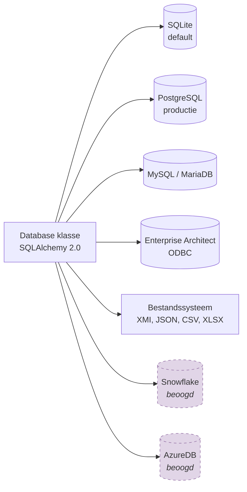

# Lagendetail

## Laag 1: Presentatielaag

De presentatielaag vormt het contactpunt met de gebruiker en regelt commando-verwerking, logging en configuratie.

### cli.py — Command Line Interface

Hoofd-entrypoint geregistreerd als `crunch_uml` console-script. Biedt drie subcommando's:

```bash
crunch_uml [-v] [-d] [-w] [-db_url URL] [-sch SCHEMA] {import,transform,export} ...
```

| Argument | Beschrijving |
|---|---|
| `-v / --verbose` | INFO-level logging |
| `-d / --debug` | DEBUG-level logging |
| `-db_url` | Database connection string |
| `-sch / --schema_name` | Naam van het werkschema |

De `main()` functie valideert argumenten, configureert logging, en delegeert naar de juiste registry op basis van het commando.

### const.py — Constanten

Bevat database URL defaults, XML namespaces (XMI 2.0.1, UML 2.0.1), commando-constanten, EA Repository mappers, tag-profielen en taalconfiguratie.

### Beoogde uitbreidingen

!!! note "REST API Interface"
    FastAPI of Flask-gebaseerde web-interface voor het aansturen van import/transform/export via HTTP.

!!! note "Configuratiemodule"
    Overkoepelende interface voor beheer van transformatiepipelines, inclusief monitoring en reproduceerbaarheid.

---

## Laag 2: Orchestratielaag

De orchestratielaag beheert het registry-pattern en het plugin framework.

### Registry Pattern

```python
class Registry:
    @classmethod
    def register(name, descr="")   # Decorator voor registratie

    @classmethod
    def entries()                   # Lijst geregistreerde namen

    @classmethod
    def getinstance(name)           # Instantiëer geregistreerde klasse

    @classmethod
    def getDescription(name)        # Beschrijving opvragen
```

Drie subklassen implementeren dit patroon:

| Registry | Aantal | Functie |
|---|---|---|
| `ParserRegistry` | 7 | Maps input types naar parser klassen |
| `RendererRegistry` | 11 | Maps output types naar renderer klassen |
| `TransformerRegistry` | 2+ | Maps transformatie types naar transformer klassen |

### Plugin Framework

Dynamisch laden van custom transformatie-plugins via CLI-argumenten `--plugin_file_name` en `--plugin_class_name`. Plugins extenden de `Plugin` base class.

---

## Laag 3: Verwerkingslagen

Zie de gedetailleerde pagina's:

- [Parsers (Import)](../componenten/parsers.md)
- [Transformers](../componenten/transformers.md)
- [Renderers (Export)](../componenten/renderers.md)

---

## Laag 4: Persistentielaag

Zie [Persistentie](../componenten/persistentie.md) en [Datamodel](../datamodel.md).

---

## Laag 5: Externe Systemen

crunch_uml ondersteunt meerdere databases via SQLAlchemy:



---

## Laag 6: Hulpmodules

| Module | Functie |
|---|---|
| `util.py` | URL-validatie, GUID-generatie, datum-parsing, Dutch pluralisatie |
| `lang.py` | Vertaalwrapper via `translators` library met retry-logica |
| `exceptions.py` | Custom exception klassen |
| `templates/` | Jinja2 templates (GGM Markdown, JSON Schema, DDAS, SQLAlchemy) |
| `json_datatypes.json` | Datatype-mapping configuratie |
