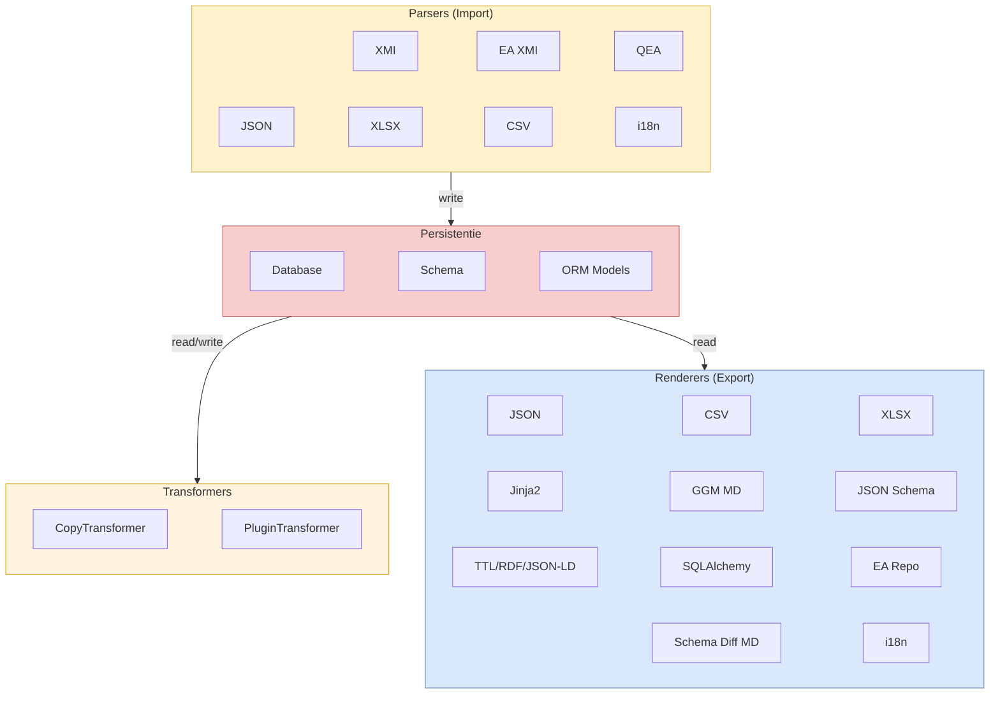

# Componenten

crunch_uml is opgebouwd uit vier componentgroepen die elk een specifieke rol vervullen in de verwerkingspipeline.

## Pagina's

- [Parsers](parsers.md) — 7 geregistreerde input-parsers
- [Transformers](transformers.md) — Copy, Plugin en beoogde transformers
- [Renderers](renderers.md) — 11 geregistreerde output-renderers
- [Persistentie](persistentie.md) — Database, Schema en ORM-modellen
