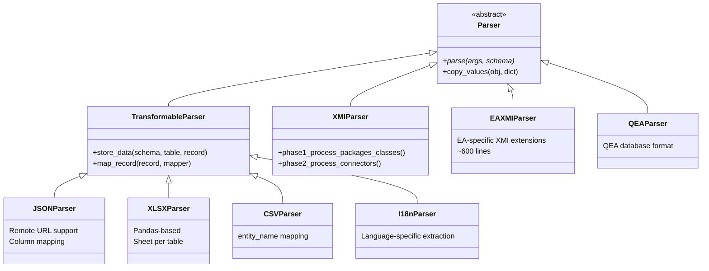

# Parsers (Import Layer)

All parsers inherit from the abstract `Parser` class and register themselves via `@ParserRegistry.register()`.

## Class Hierarchy



## Registered Parsers

### XMI Parser

- **Registration**: `@ParserRegistry.register("xmi")`
- **File**: `parsers/xmiparser.py`
- **Function**: Standard XMI 2.1 format
- **Features**: Two-phase parsing (structure → relationships), XML encoding detection & recovery

### EA XMI Parser

- **Registration**: `@ParserRegistry.register("eaxmi")`
- **File**: `parsers/eaxmiparser.py`
- **Function**: Enterprise Architect XMI with EA-specific extensions
- **Features**: Processes diagrams, extended tags, EA metadata. Approximately 600 lines.

### QEA Parser

- **Registration**: `@ParserRegistry.register("qea")`
- **File**: `parsers/qeaparser.py`
- **Function**: QEA database format (EA native)

### JSON Parser

- **Registration**: `@ParserRegistry.register("json")`
- **File**: `parsers/multiple_parsers.py`
- **Function**: JSON with table names as keys, arrays of records
- **Features**: Remote URL support, `--mapper` for column renaming, `--update_only` mode

### XLSX Parser

- **Registration**: `@ParserRegistry.register("xlsx")`
- **Function**: Excel files with one sheet per table
- **Implementation**: Pandas-based row-by-row processing

### CSV Parser

- **Registration**: `@ParserRegistry.register("csv")`
- **Function**: Single CSV file with `--entity_name` for target table

### i18n Parser

- **Registration**: `@ParserRegistry.register("i18n")`
- **Function**: Language-specific data extraction, integration with translation fields

## CLI Arguments (Import)

| Argument | Description |
|---|---|
| `-f / --inputfile` | Path to input file |
| `-url` | Remote URL (JSON) |
| `-t / --inputtype` | Parser type (xmi, eaxmi, qea, json, xlsx, csv, i18n) |
| `--skip_xmi_relations` | Skip phase 2 (structure only) |
| `--mapper` | JSON string for column renaming |
| `--update_only` | Update existing records only |

## Planned Extensions

!!! note "API Endpoint Parser"
    Direct integration with external model repositories via REST APIs.

!!! note "Streaming / Chunked Parser"
    Processing of large files in chunks to limit memory usage.

## Adding a New Parser

```python
from crunch_uml.parsers.parser import Parser, ParserRegistry

@ParserRegistry.register("my_format", descr="My custom parser")
class MyParser(Parser):
    def parse(self, args, schema):
        # Read input
        # Create ORM objects
        # schema.save(obj, recursive=True)
        pass
```
