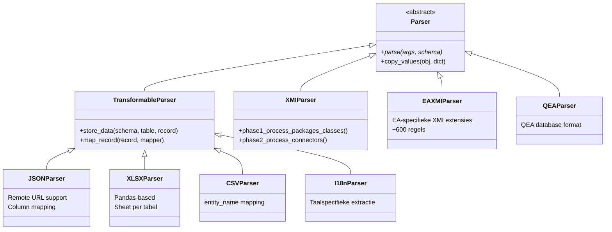

# Parsers (Importlaag)

Alle parsers erven van de abstracte `Parser` klasse en registreren zich via `@ParserRegistry.register()`.

## Klasse-hiërarchie



## Geregistreerde Parsers

### XMI Parser

- **Registratie**: `@ParserRegistry.register("xmi")`
- **Bestand**: `parsers/xmiparser.py`
- **Functie**: Standaard XMI 2.1 format
- **Bijzonderheden**: Twee-fasen parsing (structuur → relaties), XML encoding detectie & recovery

### EA XMI Parser

- **Registratie**: `@ParserRegistry.register("eaxmi")`
- **Bestand**: `parsers/eaxmiparser.py`
- **Functie**: Enterprise Architect XMI met EA-specifieke extensies
- **Bijzonderheden**: Verwerkt diagrammen, extended tags, EA-metadata. Circa 600 regels.

### QEA Parser

- **Registratie**: `@ParserRegistry.register("qea")`
- **Bestand**: `parsers/qeaparser.py`
- **Functie**: QEA database-formaat (EA native)

### JSON Parser

- **Registratie**: `@ParserRegistry.register("json")`
- **Bestand**: `parsers/multiple_parsers.py`
- **Functie**: JSON met tabelnamen als keys, arrays van records
- **Features**: Remote URL-ondersteuning, `--mapper` voor kolom-hernoemen, `--update_only` modus

### XLSX Parser

- **Registratie**: `@ParserRegistry.register("xlsx")`
- **Functie**: Excel-bestanden met één sheet per tabel
- **Implementatie**: Pandas-gebaseerde row-by-row verwerking

### CSV Parser

- **Registratie**: `@ParserRegistry.register("csv")`
- **Functie**: Enkel CSV-bestand met `--entity_name` voor doeltabel

### i18n Parser

- **Registratie**: `@ParserRegistry.register("i18n")`
- **Functie**: Taalspecifieke data-extractie, integratie met vertaalvelden

## CLI-argumenten (Import)

| Argument | Beschrijving |
|---|---|
| `-f / --inputfile` | Pad naar invoerbestand |
| `-url` | Remote URL (JSON) |
| `-t / --inputtype` | Type parser (xmi, eaxmi, qea, json, xlsx, csv, i18n) |
| `--skip_xmi_relations` | Sla fase 2 over (alleen structuur) |
| `--mapper` | JSON string voor kolom-hernoemen |
| `--update_only` | Alleen bestaande records bijwerken |

## Beoogde uitbreidingen

!!! note "API Endpoint Parser"
    Directe integratie met externe model-repositories via REST API's.

!!! note "Streaming / Chunked Parser"
    Verwerking van grote bestanden in chunks om geheugengebruik te beperken.

## Een nieuwe parser toevoegen

```python
from crunch_uml.parsers.parser import Parser, ParserRegistry

@ParserRegistry.register("mijn_formaat", descr="Mijn custom parser")
class MijnParser(Parser):
    def parse(self, args, schema):
        # Lees invoer
        # Creëer ORM objecten
        # schema.save(obj, recursive=True)
        pass
```
