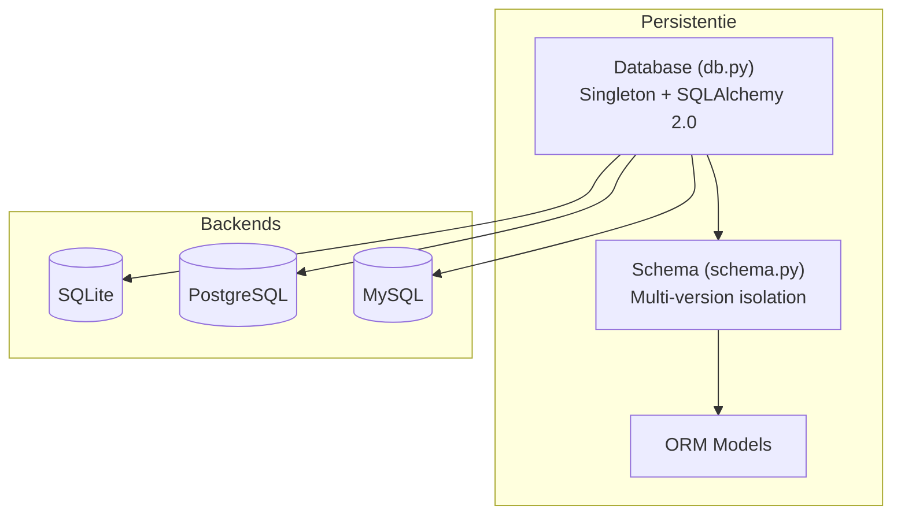
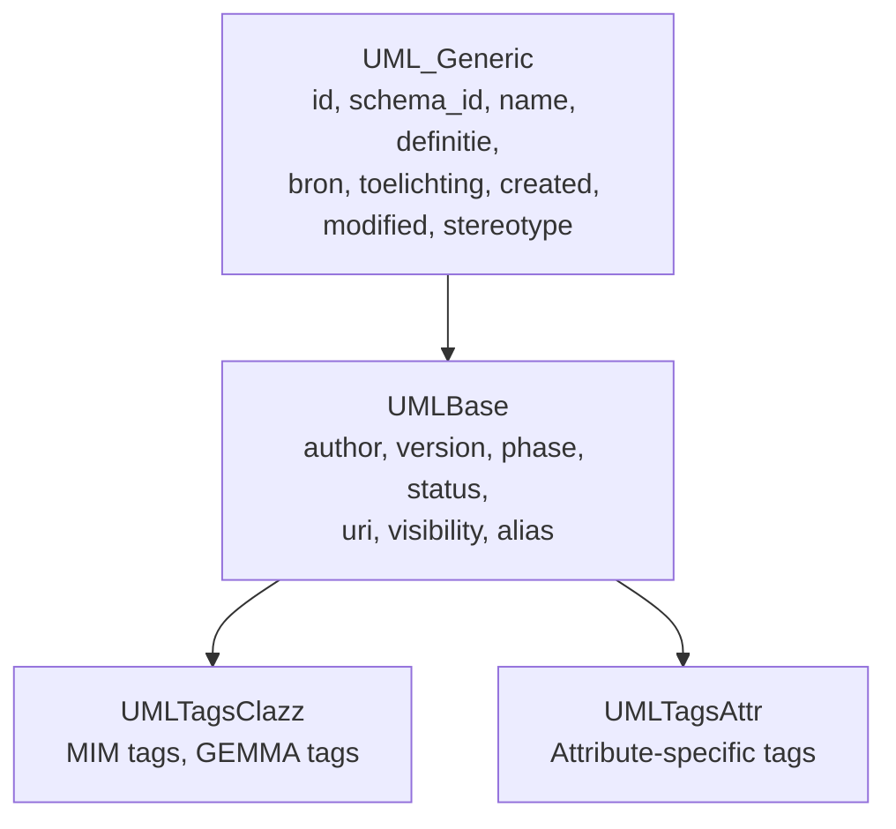

# Persistence Layer

The persistence layer forms the heart of crunch_uml: a standardized metaschema stored via SQLAlchemy ORM with multi-version support.

## Architecture



## Database Class

Singleton implementation that guarantees one active connection per process.

```python
Database(db_url=const.DATABASE_URL, db_create=False)
    .session          # SQLAlchemy session
    .engine           # SQLAlchemy engine
    .commit()         # Commit changes
    .rollback()       # Rollback transaction
    .close()          # Close session
    .add(obj)         # Add new object
    .save(obj)        # Save/merge object
```

**Default database URL**: `sqlite:///crunch_uml.db`

## Schema Class

Wrapper around a logical schema in the database. Enables multi-version models in one database via `schema_id` on all tables.

```python
Schema(database, schema_name=const.DEFAULT_SCHEMA)
    .add(obj, recursive=False)           # Add to schema
    .save(obj, recursive=False)          # Save/merge in schema
    .get_package(id)                     # Get package
    .get_class(id)                       # Get class
    .get_all_packages()                  # All packages
    .get_all_classes()                   # All classes
    .count_package()                     # Count packages
    .clean()                             # Delete everything in schema
```

## ORM Models

All models inherit from `UML_Generic` and optionally `UMLBase` and `UMLTags*` mixins. See [Data Model](../datamodel.md) for the complete entity-relationship diagram.

### Model Overview

| Model | Table | Important Fields |
|---|---|---|
| Package | `packages` | id, name, parent_package_id, schema_id |
| Class | `classes` | id, name, package_id, is_datatype |
| Attribute | `attributes` | id, name, clazz_id, primitive, enumeratie_id |
| Association | `associations` | id, src_class_id, dst_class_id, multiplicities |
| Generalization | `generalizations` | id, superclass_id, subclass_id |
| Enumeration | `enumeraties` | id, name, package_id |
| EnumerationLiteral | `enumeratie_literals` | id, name, enumeratie_id |
| Diagram | `diagrams` | id, name, package_id |

### Junction Tables

| Table | Connects |
|---|---|
| `diagram_classes` | Diagram ↔ Class |
| `diagram_enumerations` | Diagram ↔ Enumeration |
| `diagram_associations` | Diagram ↔ Association |
| `diagram_generalizations` | Diagram ↔ Generalization |

## Mixins



## Planned Extensions

!!! note "Caching & Validation Engine"
    Cache mechanism for stored validations so that not every validation has to run completely from scratch.

!!! note "Indexing Techniques"
    Full-text indexing, fuzzy indexing, and AI-based indexing for more efficient queries on large models.

!!! note "Centralized Repository"
    Hierarchically documented metaschema with unique identifiers for relationships.
