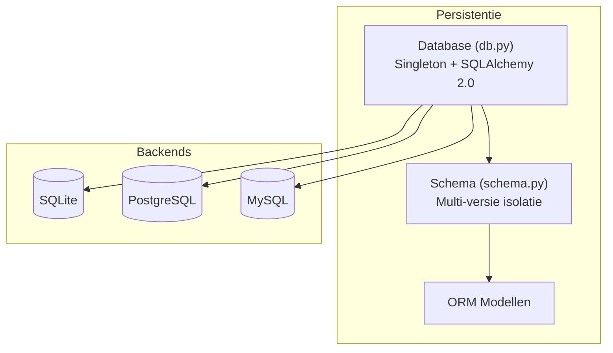
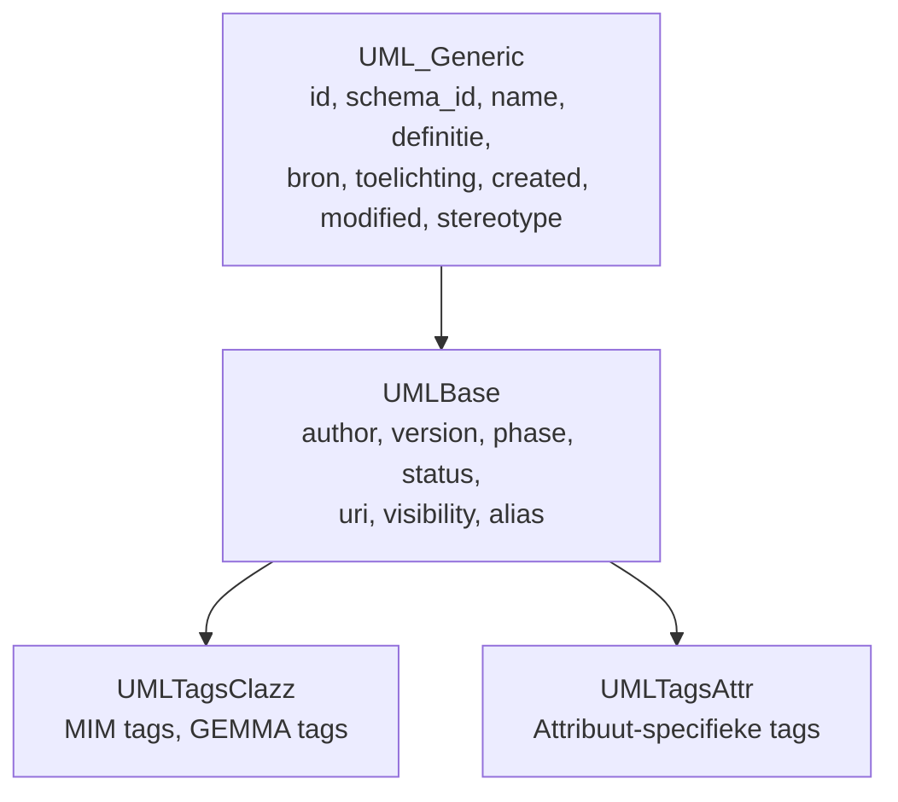

# Persistentielaag

De persistentielaag vormt het hart van crunch_uml: een gestandaardiseerd metaschema opgeslagen via SQLAlchemy ORM met multi-versie ondersteuning.

## Architectuur



## Database klasse

Singleton-implementatie die één actieve verbinding per proces garandeert.

```python
Database(db_url=const.DATABASE_URL, db_create=False)
    .session          # SQLAlchemy session
    .engine           # SQLAlchemy engine
    .commit()         # Commit wijzigingen
    .rollback()       # Rollback transactie
    .close()          # Sluit session
    .add(obj)         # Voeg nieuw object toe
    .save(obj)        # Save/merge object
```

**Default database URL**: `sqlite:///crunch_uml.db`

## Schema klasse

Wrapper rondom een logisch schema in de database. Maakt multi-versie modellen in één database mogelijk via `schema_id` op alle tabellen.

```python
Schema(database, schema_name=const.DEFAULT_SCHEMA)
    .add(obj, recursive=False)           # Voeg toe aan schema
    .save(obj, recursive=False)          # Save/merge in schema
    .get_package(id)                     # Haal package op
    .get_class(id)                       # Haal class op
    .get_all_packages()                  # Alle packages
    .get_all_classes()                   # Alle classes
    .count_package()                     # Tel packages
    .clean()                             # Verwijder alles in schema
```

## ORM-modellen

Alle modellen erven van `UML_Generic` en optioneel `UMLBase` en `UMLTags*` mixins. Zie [Datamodel](../datamodel.md) voor het volledige entity-relationship diagram.

### Modeloverzicht

| Model | Tabel | Belangrijkste velden |
|---|---|---|
| Package | `packages` | id, name, parent_package_id, schema_id |
| Class | `classes` | id, name, package_id, is_datatype |
| Attribute | `attributes` | id, name, clazz_id, primitive, enumeratie_id |
| Association | `associations` | id, src_class_id, dst_class_id, multipliciteiten |
| Generalization | `generalizations` | id, superclass_id, subclass_id |
| Enumeratie | `enumeraties` | id, name, package_id |
| EnumerationLiteral | `enumeratie_literals` | id, name, enumeratie_id |
| Diagram | `diagrams` | id, name, package_id |

### Junction Tables

De diagram-koppeltabellen dragen naast de membership ook de **layout** van elementen op een diagram (nullable geometriekolommen, canoniek coördinatenstelsel — zie [Datamodel](../datamodel.md)):

| Tabel | Koppelt | Geometrie |
|---|---|---|
| `diagram_class` | Diagram ↔ Class | x, y, width, height, z_order, ea_style |
| `diagram_enumeration` | Diagram ↔ Enumeratie | x, y, width, height, z_order, ea_style |
| `diagram_association` | Diagram ↔ Association | waypoints (JSON), hidden, ea_geometry, ea_style |
| `diagram_generalization` | Diagram ↔ Generalization | waypoints (JSON), hidden, ea_geometry, ea_style |

## Datamodelversie en migratie

Elke database bevat een versiemarkering in de tabel `crunch_uml_meta` (bewust buiten `Base.metadata`, zodat hij nooit in exports opduikt). Bij het verbinden:

- **Zelfde versie** of een database van vóór dit mechanisme: ontbrekende tabellen en nullable kolommen worden **additief** toegevoegd (`Database._add_missing_tables_and_columns`); data blijft staan.
- **Andere versie**: de database is incompatibel en wordt met een duidelijke waarschuwing **opnieuw aangemaakt**; modellen moeten opnieuw geïmporteerd worden.

`DATAMODEL_VERSION` (in `db.py`) wordt alléén opgehoogd bij wijzigingen die de additieve migratie niet aankan (hernoemde/hertypeerde kolommen, gewijzigde primary keys of semantiek).

## Mixins



## Beoogde uitbreidingen

!!! note "Caching & Validatie Engine"
    Cache-mechanisme voor opgeslagen validaties zodat niet elke validatie volledig opnieuw hoeft te draaien.

!!! note "Indexeringstechnieken"
    Full-text indexing, fuzzy indexing, en AI-gebaseerde indexing voor efficiëntere queries op grote modellen.

!!! note "Gecentraliseerde Repository"
    Hiërarchisch gedocumenteerd metaschema met unique identifiers voor relaties.
