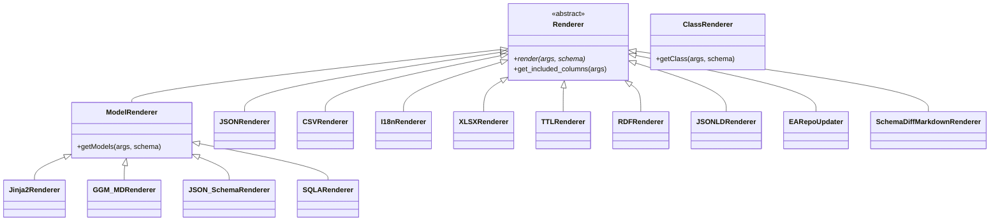
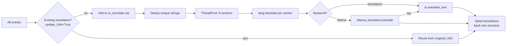
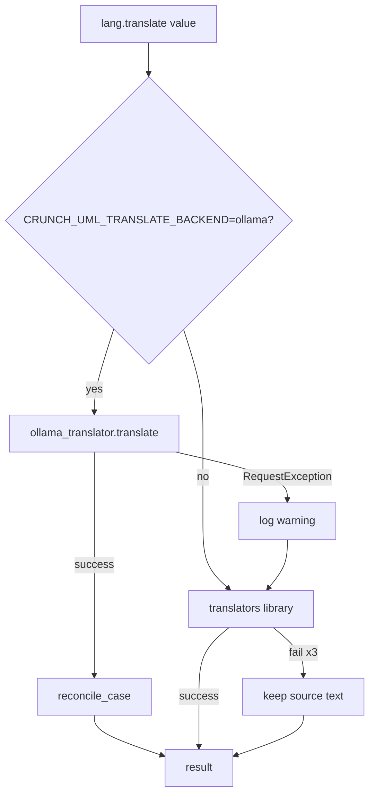

# Renderers (Export Layer)

Renderers generate output in diverse formats based on the stored models. They register themselves via `@RendererRegistry.register()`.

## Class Hierarchy



## Overview

| Renderer | Type | File | Output Format |
|---|---|---|---|
| XMIRenderer | `xmi` | `xmirenderer.py` | XMI 2.1 + EA extension, incl. diagrams with geometry |
| JSONRenderer | `json` | `pandasrenderer.py` | JSON (array of records / indexed) |
| CSVRenderer | `csv` | `pandasrenderer.py` | CSV per table |
| I18nRenderer | `i18n` | `pandasrenderer.py` | Translation JSON |
| XLSXRenderer | `xlsx` | `xlsxrenderer.py` | Excel (.xlsx) |
| Jinja2Renderer | `jinja2` | `jinja2renderer.py` | Custom template output |
| GGM_MDRenderer | `ggm_md` | `jinja2renderer.py` | Markdown (GGM format) |
| JSON_SchemaRenderer | `json_schema` | `jinja2renderer.py` | JSON Schema |
| TTLRenderer | `ttl` | `lodrenderer.py` | Turtle (RDF) |
| RDFRenderer | `rdf` | `lodrenderer.py` | RDF/XML |
| JSONLDRenderer | `jsonld` | `lodrenderer.py` | JSON-LD |
| SQLARenderer | `sqla` | `sqlarenderer.py` | Python SQLAlchemy code |
| EARepoUpdater | `ea_repo` | `earepoupdater.py` | Direct EA database update |
| SchemaDiffMD | `schema_diff_md` | `jinja2renderer.py` | Schema comparison markdown |

---

## XMI Renderer

The `xmi` renderer (`renderers/xmirenderer.py`) writes the complete schema as **XMI 2.1 with an Enterprise Architect extension section** — the mirror image of what the `eaxmi` parser reads:

- **Strict part**: `uml:Model` with packages, classes (incl. attributes), enumerations (incl. literals), associations (incl. ends/cardinalities/roles) and generalizations, with the existing ids as `xmi:id`.
- **Extension part**: documentation, project metadata, tagged values, connector roles and, per diagram, a `<diagram>` element with the geometry in EA format (the exact inverse of the parser conversions, including the y-flip for edge waypoints).

The output can be re-imported via crunch_uml's own `eaxmi` parser (lossless round-trip, covered by acceptance tests on four fixtures) and imported into Sparx EA. Where the XMI spec and EA collide, EA wins; every deviation is documented in [`crunch_uml/renderers/EA_QUIRKS.md`](https://github.com/brienen/crunch_uml/blob/main/crunch_uml/renderers/EA_QUIRKS.md).

---

## Tabular Renderers

**JSON, CSV, XLSX** — Pandas-based export with support for:

- Column filtering via `--output_columns`
- Key renaming via `--mapper`
- Multiple record types: `RECORD_TYPE_RECORD` (array) or `RECORD_TYPE_INDEXED` (object with ID as key)

---

## I18n renderer and translation backends

The `I18nRenderer` exports translatable fields to a JSON i18n file and can
optionally translate them in-flight. Two backends are available:

| Backend | Source | Speed | Quality |
| --- | --- | --- | --- |
| `translators` (default) | Google/Bing via the `translators` library | ~0.1 s per call (network) | OK for prose, weak on identifiers |
| `ollama` | Local LLM (Mistral) via Ollama | ~0.3-1 s per call (local) | Strong on domain jargon, casing preserved |

### Pipeline of `translate_data`



### Three passes in `I18nRenderer.translate_data`

1. **Collect** — walk through every entry, gather unique strings in a set;
   skip any string already translated in `original_i18n`.
2. **Translate in parallel** — `ThreadPoolExecutor(max_workers=8)`,
   configurable via `--translate_workers` or `CRUNCH_UML_TRANSLATE_WORKERS`.
   The GIL is released during HTTP calls, so scaling is near-linear.
3. **Rebuild** — reconstruct the output structure, filling in the
   translations from the dedup cache.

Effect: a GGM model with ~500 unique strings translates in 1-2 minutes
instead of 10+ minutes (old per-call pipeline).

### Ollama backend specifics

`crunch_uml/ollama_translator.py` wraps three deterministic safety layers
around the LLM call:

| Layer | Purpose |
| --- | --- |
| **Opaque-token preserve filter** | XML tags (`<memo>`), EAID identifiers, URLs, ISO dates and pure punctuation are returned verbatim without an LLM call. Prevents hallucination around `<memo>` and GUIDs. |
| **`num_predict` cap** | Cap on output tokens (4× input + 128, max 2048). Prevents runaway generation. |
| **`reconcile_case` safety net** | If the source is a `camelCase` / `PascalCase` / `snake_case` / `kebab-case` / `ALL_CAPS` identifier and the LLM output contains whitespace, the helper splits the output and deterministically re-cases it. |

### Fallback chain



A missing Ollama server never breaks the pipeline; the external API
catches every failure.

End-user guide: see [Translations](../../handleiding/vertalingen.md).

---

## Template Renderers

**Jinja2, GGM Markdown, JSON Schema** — Based on Jinja2 templates in `crunch_uml/templates/`:

| Template | Application |
|---|---|
| `ggm_markdown.j2` | Dutch government documentation |
| `json_schema.j2` | JSON Schema for validation |
| `ddas_markdown.j2` | DDAS-specific documentation |
| `ggm_sqlalchemy.j2` | SQLAlchemy model code |

HTML-to-Markdown conversion via BeautifulSoup + markdownify.

---

## Linked Data Renderers

**TTL, RDF, JSON-LD** — Via rdflib with namespace support (`--linked_data_namespace`). Generates RDF/OWL ontologies based on the stored model.

---

## EA Repo Updater

!!! warning "Destructive Operations"
    The EA Repo Updater has direct ODBC access to Enterprise Architect databases. Contains flags for dangerous operations:

    - `--ea_allow_insert` — Allow new records
    - `--ea_allow_delete` — Allow deletions

    Tag strategies: `update` | `upsert` | `replace`

Besides the model elements, the **diagram layout** is also written back to `t_diagramobjects` and `t_diagramlinks`: existing rows are updated, new membership is inserted and lapsed membership is removed, with the same coordinate conversions as the qea parser (inverted). Rows of element types that crunch_uml does not manage (Notes, packages) and of elements unknown to the schema are left untouched — a partial export does not wreck layout it knows nothing about.

---

## Schema Diff Renderer

Compares two schemas via `--compare_schema_name` and generates a markdown diff report.

---

## CLI Arguments (Export)

| Argument | Description |
|---|---|
| `-f / --outputfile` | Path to output file |
| `-t / --outputtype` | Renderer type |
| `-pi / --output_package_ids` | Filter on specific packages |
| `-jt / --output_jinja2_template` | Custom Jinja2 template |
| `-jtd` | Template directory |
| `--linked_data_namespace` | Namespace for LOD renderers |
| `--compare_schema_name` | Schema for diff comparison |

## Planned Extensions

!!! note "GraphQL Schema Renderer"
    Generate GraphQL schemas based on the stored model.

!!! note "OpenAPI Renderer"
    Generate OpenAPI/Swagger specifications for REST APIs.

## Adding a New Renderer

```python
from crunch_uml.renderers.renderer import Renderer, RendererRegistry

@RendererRegistry.register("my_format", descr="Custom output")
class MyRenderer(Renderer):
    def render(self, args, schema):
        models = schema.get_all_classes()
        # Generate output
        ...
```
