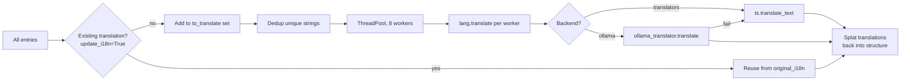
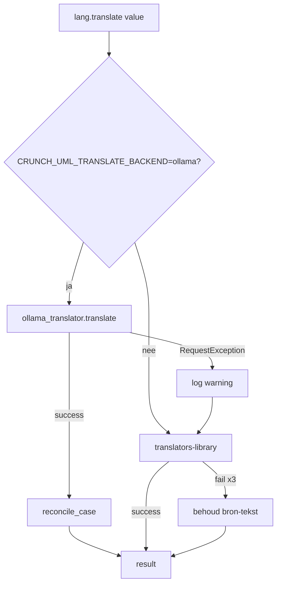

# Renderers (Exportlaag)

Renderers genereren output in diverse formaten op basis van de opgeslagen modellen. Ze registreren zich via `@RendererRegistry.register()`.

## Klasse-hiërarchie


## Overzicht

| Renderer | Type | Bestand | Outputformaat |
|---|---|---|---|
| JSONRenderer | `json` | `pandasrenderer.py` | JSON (array of records / indexed) |
| CSVRenderer | `csv` | `pandasrenderer.py` | CSV per tabel |
| I18nRenderer | `i18n` | `pandasrenderer.py` | Vertaal-JSON |
| XLSXRenderer | `xlsx` | `xlsxrenderer.py` | Excel (.xlsx) |
| Jinja2Renderer | `jinja2` | `jinja2renderer.py` | Custom template output |
| GGM_MDRenderer | `ggm_md` | `jinja2renderer.py` | Markdown (GGM-formaat) |
| JSON_SchemaRenderer | `json_schema` | `jinja2renderer.py` | JSON Schema |
| TTLRenderer | `ttl` | `lodrenderer.py` | Turtle (RDF) |
| RDFRenderer | `rdf` | `lodrenderer.py` | RDF/XML |
| JSONLDRenderer | `jsonld` | `lodrenderer.py` | JSON-LD |
| SQLARenderer | `sqla` | `sqlarenderer.py` | Python SQLAlchemy code |
| EARepoUpdater | `ea_repo` | `earepoupdater.py` | Direct EA database update |
| SchemaDiffMD | `schema_diff_md` | `jinja2renderer.py` | Schema-vergelijking markdown |

---

## Tabulaire Renderers

**JSON, CSV, XLSX** — Pandas-gebaseerde export met ondersteuning voor:

- Column filtering via `--output_columns`
- Key renaming via `--mapper`
- Meerdere record-types: `RECORD_TYPE_RECORD` (array) of `RECORD_TYPE_INDEXED` (object met ID als key)

---

## I18n-renderer en vertaal-backends

De `I18nRenderer` exporteert vertaalbare velden naar een JSON-i18n-bestand
en kan deze optioneel direct vertalen. Twee backends zijn beschikbaar:

| Backend | Bron | Snelheid | Kwaliteit |
| --- | --- | --- | --- |
| `translators` (default) | Google/Bing via de `translators`-library | ~0.1 s per call (netwerklatency) | OK voor prozaregels, zwak op identifiers |
| `ollama` | Lokaal LLM (Mistral) via Ollama | ~0.3-1 s per call (lokaal) | Sterk op domeinjargon, casing wordt behouden |

### Pipeline van `translate_data`



### Drie passes in `I18nRenderer.translate_data`

1. **Verzamel** — wandel door alle entries, sla unieke strings op in een set;
   sla strings over die al een vertaling hebben in `original_i18n`.
2. **Vertaal parallel** — `ThreadPoolExecutor(max_workers=8)` (configureerbaar
   via `--translate_workers` of `CRUNCH_UML_TRANSLATE_WORKERS`). De GIL wordt
   vrijgegeven tijdens HTTP-calls; scaling is bijna lineair.
3. **Rebuild** — herbouw de output-structuur, vul vertalingen in vanuit de
   dedup-cache.

Effect: een GGM-model met ~500 unieke strings vertaalt in 1-2 minuten in
plaats van 10+ minuten (oude per-call pipeline).

### Ollama-backend specifieke logica

`crunch_uml/ollama_translator.py` voegt drie deterministische
beschermingslagen toe rondom de LLM-call:

| Laag | Doel |
| --- | --- |
| **Opaque-token preserve-filter** | XML-tags (`<memo>`), EAID-identifiers, URLs, ISO-datums en pure punctuatie worden zonder LLM-call verbatim teruggegeven. Voorkomt hallucinatie rondom `<memo>` en GUIDs. |
| **`num_predict` cap** | Limit op output-tokens (4× input + 128, max 2048). Voorkomt runaway-generatie. |
| **`reconcile_case` safety net** | Als de bron een `camelCase` / `PascalCase` / `snake_case` / `kebab-case` / `ALL_CAPS` identifier is en het LLM-resultaat spaties bevat, splitst de helper de output en zet hem deterministisch terug in de bron-casing. |

### Fallback-keten



Een ontbrekende Ollama-server breekt nooit een pijplijn; de bestaande
externe API vangt elke fout op.

Voor de eindgebruikers-handleiding zie [Vertalingen](../../handleiding/vertalingen.md).

---

## Template Renderers

**Jinja2, GGM Markdown, JSON Schema** — Gebaseerd op Jinja2 templates in `crunch_uml/templates/`:

| Template | Toepassing |
|---|---|
| `ggm_markdown.j2` | Nederlandse overheids-documentatie |
| `json_schema.j2` | JSON Schema voor validatie |
| `ddas_markdown.j2` | DDAS-specifieke documentatie |
| `ggm_sqlalchemy.j2` | SQLAlchemy modelcode |

HTML-to-Markdown conversie via BeautifulSoup + markdownify.

---

## Linked Data Renderers

**TTL, RDF, JSON-LD** — Via rdflib met namespace-ondersteuning (`--linked_data_namespace`). Genereert RDF/OWL ontologieën op basis van het opgeslagen model.

---

## EA Repo Updater

!!! warning "Destructieve operaties"
    De EA Repo Updater heeft directe ODBC-toegang tot Enterprise Architect databases. Bevat flags voor gevaarlijke operaties:

    - `--ea_allow_insert` — Toestaan van nieuwe records
    - `--ea_allow_delete` — Toestaan van verwijderingen

    Tag-strategieën: `update` | `upsert` | `replace`

---

## Schema Diff Renderer

Vergelijkt twee schema's via `--compare_schema_name` en genereert een markdown diff-rapport.

---

## CLI-argumenten (Export)

| Argument | Beschrijving |
|---|---|
| `-f / --outputfile` | Pad naar uitvoerbestand |
| `-t / --outputtype` | Type renderer |
| `-pi / --output_package_ids` | Filter op specifieke packages |
| `-jt / --output_jinja2_template` | Custom Jinja2 template |
| `-jtd` | Template directory |
| `--linked_data_namespace` | Namespace voor LOD renderers |
| `--compare_schema_name` | Schema voor diff-vergelijking |

## Beoogde uitbreidingen

!!! note "GraphQL Schema Renderer"
    Genereer GraphQL schema's op basis van het opgeslagen model.

!!! note "OpenAPI Renderer"
    Genereer OpenAPI/Swagger specificaties voor REST API's.

## Een nieuwe renderer toevoegen

```python
from crunch_uml.renderers.renderer import Renderer, RendererRegistry

@RendererRegistry.register("mijn_formaat", descr="Custom output")
class MijnRenderer(Renderer):
    def render(self, args, schema):
        models = schema.get_all_classes()
        # Genereer output
        ...
```
