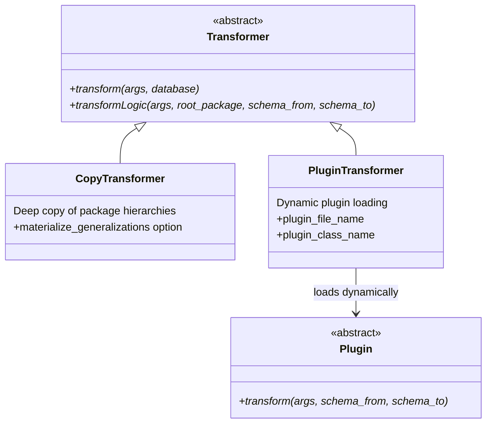
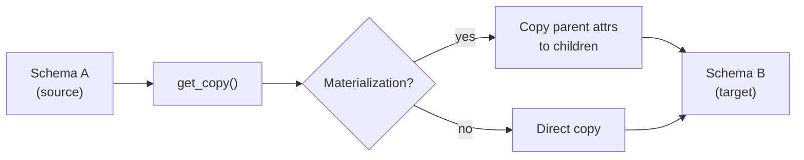

# Transformers

Transformers process data between schemas within the same database. They register themselves via `@TransformerRegistry.register()`.

## Class Hierarchy



## CopyTransformer

- **Registration**: `@TransformerRegistry.register("copy")`
- **File**: `transformers/copytransformer.py`
- **Function**: Deep copy of a complete package hierarchy from schema A to schema B
- **Options**:
    - `--materialize_generalizations` — Copies attributes from superclasses to subclasses (flattens inheritance hierarchy)
    - `--root_package` — Starting point of the copy



## PluginTransformer

- **Registration**: `@TransformerRegistry.register("plugin")`
- **File**: `transformers/plugintransformer.py`
- **Function**: Dynamically loads a custom plugin class
- **Arguments**: `--plugin_file_name`, `--plugin_class_name`

### Plugin Base Class

```python
class Plugin(ABC):
    @abstractmethod
    def transform(self, args, schema_from, schema_to):
        """Implement custom transformation logic."""
        pass
```

## CLI Arguments (Transform)

| Argument | Description |
|---|---|
| `-sch_from` | Source schema (default: current schema) |
| `-sch_to` | Target schema |
| `-ttp / --transformationtype` | Transformer type (copy, plugin) |
| `-rt_pkg / --root_package` | Root package ID for starting point |
| `-m_gen / --materialize_generalizations` | Flatten inheritance |
| `--plugin_file_name` | Path to plugin file |
| `--plugin_class_name` | Class name of the plugin |

## Planned Extensions

!!! note "Universal Mapping Layer"
    Metadata-driven, database-agnostic mapping intermediate layer. Standardizes translation to physical database models.

!!! note "Schema Diff & Merge Engine"
    Automatic comparison and merging of two schema versions.

!!! note "Generalization Materializer v2"
    Support for complex inheritance strategies (multi-level, diamond inheritance).

## Adding a New Transformer

=== "Via Registry"

    ```python
    from crunch_uml.transformers.transformer import Transformer, TransformerRegistry

    @TransformerRegistry.register("my_transform")
    class MyTransformer(Transformer):
        def transform(self, args, database):
            ...
        def transformLogic(self, args, root_package, schema_from, schema_to):
            ...
    ```

=== "Via Plugin"

    ```python
    from crunch_uml.transformers.plugin import Plugin

    class MyPlugin(Plugin):
        def transform(self, args, schema_from, schema_to):
            # Custom logic
            ...
    ```

    ```bash
    crunch_uml transform -ttp plugin \
        --plugin_file_name /path/to/my_plugin.py \
        --plugin_class_name MyPlugin
    ```
