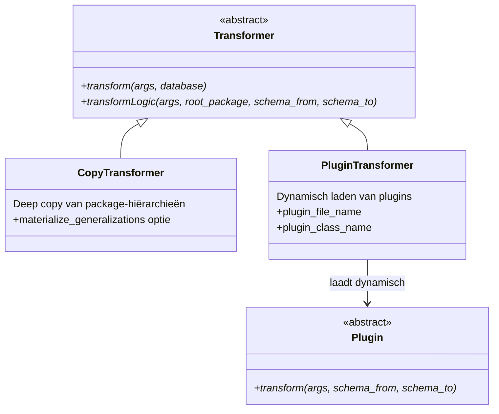
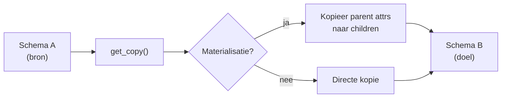

# Transformers

Transformers verwerken data tussen schema's binnen dezelfde database. Ze worden geregistreerd via `@TransformerRegistry.register()`.

## Klasse-hiërarchie



## CopyTransformer

- **Registratie**: `@TransformerRegistry.register("copy")`
- **Bestand**: `transformers/copytransformer.py`
- **Functie**: Deep copy van een volledige package-hiërarchie van schema A naar schema B
- **Opties**:
    - `--materialize_generalizations` — Kopieert attributen van superklassen naar subklassen (vlakt inheritance-hiërarchie af)
    - `--root_package` — Startpunt van de kopie



## PluginTransformer

- **Registratie**: `@TransformerRegistry.register("plugin")`
- **Bestand**: `transformers/plugintransformer.py`
- **Functie**: Laadt dynamisch een custom plugin-klasse
- **Argumenten**: `--plugin_file_name`, `--plugin_class_name`

### Plugin base class

```python
class Plugin(ABC):
    @abstractmethod
    def transform(self, args, schema_from, schema_to):
        """Implementeer custom transformatielogica."""
        pass
```

## CLI-argumenten (Transform)

| Argument | Beschrijving |
|---|---|
| `-sch_from` | Bronschema (default: huidige schema) |
| `-sch_to` | Doelschema |
| `-ttp / --transformationtype` | Type transformer (copy, plugin) |
| `-rt_pkg / --root_package` | Root package ID voor startpunt |
| `-m_gen / --materialize_generalizations` | Vlak inheritance af |
| `--plugin_file_name` | Pad naar plugin-bestand |
| `--plugin_class_name` | Klassenaam van de plugin |

## Beoogde uitbreidingen

!!! note "Universele Mapping Layer"
    Metadata-driven, database-agnostic mapping tussenlaag. Standaardiseert de vertaling naar fysieke databasemodellen.

!!! note "Schema Diff & Merge Engine"
    Automatische vergelijking en samenvoeging van twee schema-versies.

!!! note "Generalization Materializer v2"
    Ondersteuning voor complexe inheritance-strategieën (multi-level, diamond inheritance).

## Een nieuwe transformer toevoegen

=== "Via Registry"

    ```python
    from crunch_uml.transformers.transformer import Transformer, TransformerRegistry

    @TransformerRegistry.register("mijn_transform")
    class MijnTransformer(Transformer):
        def transform(self, args, database):
            ...
        def transformLogic(self, args, root_package, schema_from, schema_to):
            ...
    ```

=== "Via Plugin"

    ```python
    from crunch_uml.transformers.plugin import Plugin

    class MijnPlugin(Plugin):
        def transform(self, args, schema_from, schema_to):
            # Custom logica
            ...
    ```

    ```bash
    crunch_uml transform -ttp plugin \
        --plugin_file_name /pad/naar/mijn_plugin.py \
        --plugin_class_name MijnPlugin
    ```
