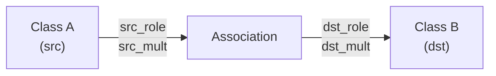
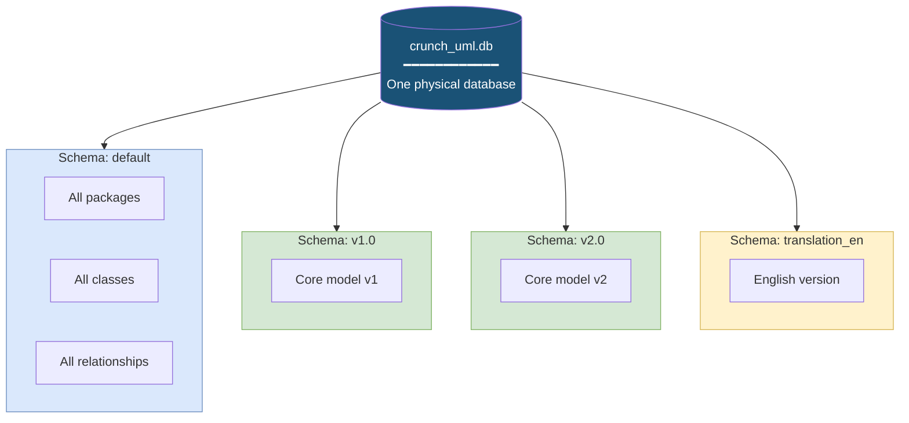

# Data Model

## Entity-Relationship Diagram

```mermaid
erDiagram
    Package ||--o{ Package : "parent_package"
    Package ||--o{ Class : "contains"
    Package ||--o{ Enumeration : "contains"
    Package ||--o{ Diagram : "contains"

    Class ||--o{ Attribute : "has"
    Class ||--o{ Association : "src_class"
    Class ||--o{ Association : "dst_class"
    Class ||--o{ Generalization : "superclass"
    Class ||--o{ Generalization : "subclass"

    Enumeration ||--o{ EnumerationLiteral : "has"
    Attribute |o--o| Enumeration : "optional type"

    Diagram }o--o{ Class : "DiagramClass"
    Diagram }o--o{ Enumeration : "DiagramEnumeration"
    Diagram }o--o{ Association : "DiagramAssociation"
    Diagram }o--o{ Generalization : "DiagramGeneralization"

    Package {
        string id PK
        string schema_id
        string name
        string parent_package_id FK
        string definitie
        string bron
        string toelichting
        string author
        string version
        string phase
        string status
        string uri
        string stereotype
        datetime created
        datetime modified
    }

    Class {
        string id PK
        string schema_id
        string name
        string package_id FK
        boolean is_datatype
        string definitie
        string bron
        string toelichting
        string author
        string version
        string phase
        string status
        string uri
        string stereotype
    }

    Attribute {
        string id PK
        string schema_id
        string name
        string clazz_id FK
        string primitive
        string enumeratie_id FK
        string definitie
        string bron
        string toelichting
    }

    Association {
        string id PK
        string schema_id
        string name
        string src_class_id FK
        string dst_class_id FK
        string src_mult_start
        string src_mult_end
        string dst_mult_start
        string dst_mult_end
        string src_role
        string dst_role
        string src_documentation
        string dst_documentation
    }

    Generalization {
        string id PK
        string schema_id
        string name
        string superclass_id FK
        string subclass_id FK
    }

    Enumeration {
        string id PK
        string schema_id
        string name
        string package_id FK
        string definitie
        string bron
    }

    EnumerationLiteral {
        string id PK
        string schema_id
        string name
        string enumeratie_id FK
    }

    Diagram {
        string id PK
        string schema_id
        string name
        string package_id FK
    }

    DiagramClass {
        string diagram_id PK
        string schema_id PK
        string class_id PK
        float x
        float y
        float width
        float height
        int z_order
        text ea_style
    }

    DiagramAssociation {
        string diagram_id PK
        string schema_id PK
        string association_id PK
        text waypoints
        boolean hidden
        text ea_geometry
        text ea_style
    }
```

## Model Details

### Package

Container for classes and enumerations. Packages form a hierarchy via self-referencing `parent_package_id`.

**Important methods**:

- `get_classes()` — All classes in this package
- `get_enumerations()` — All enumerations
- `is_model()` — Is this a top-level model package?
- `get_classes_in_model()` — All classes recursively in the hierarchy
- `get_copy()` — Deep copy of the package and all children

### Class

UML Class entity with attributes and relationships.

**Relationships**:

- `package` — Parent package
- `attributes` — 1:N relationship with Attribute
- `outgoing_associations` — Associations where this class is the source
- `incoming_associations` — Associations where this class is the target
- `superclasses` — Generalizations as subclass
- `subclasses` — Generalizations as superclass

**Important methods**:

- `get_attribute_by_name()` — Look up attribute by name
- `copy_attributes()` — Copy attributes to another class
- `get_copy()` — Deep copy including attributes

### Attribute

Property of a Class. Can have a primitive type (`primitive` as string) or a reference to an Enumeration.

### Association

Bidirectional relationship between two Classes with multiplicities and role names.



### Generalization

Inheritance relationship between two classes. Contains a `materialize()` method that copies attributes from the superclass to the subclass.

### Enumeration & EnumerationLiteral

Enumeration type with named values. EnumerationLiteral contains the individual values.

### Diagram

Visual diagram that references classes, enumerations, associations and generalizations via junction tables.

#### Diagram geometry

Besides membership, the four junction tables also carry the layout of elements on the diagram. All geometry columns are **nullable**: membership without a known layout stays valid, and files or databases written before these columns existed remain importable.

**Node-like** (`DiagramClass`, `DiagramEnumeration`):

| Column | Type | Meaning |
|---|---|---|
| `x` | Float | left edge, canonical coordinates |
| `y` | Float | top edge, canonical coordinates |
| `width` | Float | width |
| `height` | Float | height |
| `z_order` | Integer | stacking order (EA `seqno`/`Sequence`) |
| `ea_style` | Text | raw EA style string, kept losslessly for round-trips |

**Edge-like** (`DiagramAssociation`, `DiagramGeneralization`):

| Column | Type | Meaning |
|---|---|---|
| `waypoints` | Text (JSON) | `[{"x": .., "y": ..}, ...]` in canonical coordinates; empty list or NULL = no intermediate points |
| `hidden` | Boolean | EA `Hidden` flag |
| `ea_geometry` | Text | raw EA geometry string (SX/SY/EX/EY/EDGE/label positions/Path) — lossless |
| `ea_style` | Text | raw EA style string — lossless |

**Canonical coordinate system**: origin in the top-left corner, x grows to the right, y grows downwards, all values positive. All conversions to and from EA conventions happen in the parsers and renderers; the database only ever contains canonical values. The EA conventions (verified against real files):

- XMI extension node geometry (`Left=..;Top=..;Right=..;Bottom=..;`) uses **positive** Top/Bottom: `x=Left`, `y=Top`, `width=Right-Left`, `height=Bottom-Top`.
- `t_diagramobjects` in a `.qea` repository stores **negative** RectTop/RectBottom: `x=RectLeft`, `y=-RectTop`, `width=RectRight-RectLeft`, `height=RectTop-RectBottom`.
- `Path=` waypoints have negative y in **both** sources; canonical waypoints flip the sign. XMI separates x:y pairs with `$`, the qea `Path` column with `;`.

#### Datamodel version and migration

Every crunch_uml database carries a datamodel version number in the `crunch_uml_meta` table (key `datamodel_version`). On connect:

- **Same version** (or a database predating this mechanism): missing tables and nullable columns are added **additively**; existing data is kept.
- **Different version**: the database is incompatible and is **recreated**. All data is discarded (with a clear warning in the log); re-import your models.

The version number (`DATAMODEL_VERSION` in `crunch_uml/db.py`) is only bumped for schema changes the additive migration cannot handle (renamed or retyped columns, changed primary keys or semantics). The `crunch_uml_meta` table deliberately lives outside the ORM model, so it never shows up in json/xlsx/csv exports.

#### Diagram coverage matrix

Which parsers and renderers read or write diagram membership and geometry:

| Component | Diagram membership | Geometry |
|---|---|---|
| `eaxmi` parser | reads | reads |
| `qea` parser | reads | reads |
| `xmi` parser (strict) | n/a — strict XMI 2.1 carries no diagrams | n/a |
| `xmi` renderer | writes | writes |
| `json` parser/renderer | reads/writes | reads/writes |
| `csv` parser/renderer | reads/writes (one file per junction table) | reads/writes |
| `xlsx` parser/renderer | reads/writes (one sheet per junction table) | reads/writes |
| `i18n` parser/renderer | n/a — junction tables have no `id` column and contain nothing translatable | n/a |
| `earepo`/`eamimrepo` renderer | writes (`t_diagramobjects`/`t_diagramlinks`: update, insert, delete) | writes |
| `sqla` renderer | n/a — generates code for the modelled domain, not for diagrams | n/a |
| Semantic renderers (`jinja2`, `ggm_md`, `json_schema`, `plain_html`, `model_overview_md`, `er_diagram`, `openapi`, `ttl`, `rdf`, `json-ld`, `shex`, `profile`, `uml_mmd`, `model_stats_md`, `diff_md`) | n/a — geometry has no meaning in these output formats | n/a |

## Mixin Structure

All entities share fields via mixins:

| Mixin | Fields | Used by |
|---|---|---|
| `UML_Generic` | id, schema_id, name, definitie, bron, toelichting, created, modified, stereotype | All entities |
| `UMLBase` | author, version, phase, status, uri, visibility, alias | Package, Class, Attribute, etc. |
| `UMLTagsClazz` | MIM tags, GEMMA tags, history indicators | Class |
| `UMLTagsAttr` | Attribute-specific tags | Attribute |
| `UMLTagsAssoc` | Association-specific tags | Association |

## Schema Isolation: Reading the Same Model Multiple Times

One of the most powerful features of crunch_uml is that you can read the same model multiple times in **different schemas** within the same database. All tables contain a `schema_id` column that enables this isolation.

### How Does It Work?

Each schema is like a separate "compartment" in the database. When you import or transform a model, you specify with `-sch` which schema the data should go into. Entities in one schema are completely separate from entities in another — they coexist in the same database but do not overlap.



### Typical Applications

**Version Comparison** — Import two versions of the same model (each in its own schema) and use the `diff_md` renderer to automatically report the differences:

```bash
# Version 2.0 in default schema (already imported)
crunch_uml transform -ttp copy -sch_to version_2 -rt_pkg ROOT

# Version 1.0 in separate schema
crunch_uml -sch v1_raw import -f model_v1.xmi -t eaxmi
crunch_uml transform -ttp copy -sch_from v1_raw -sch_to version_1 -rt_pkg ROOT

# Generate diff
crunch_uml -sch version_1 export -t diff_md -f diff.md \
    --compare_schema_name version_2 --compare_title "v1 → v2"
```

**Multi-Language** — Copy the model to a translation schema and import translations:

```bash
crunch_uml transform -ttp copy -sch_to translation_en -rt_pkg ROOT
crunch_uml -sch translation_en import -f translations.json -t i18n --language en
```

**Partial Models** — Copy only a specific package (and everything below it) to a working schema:

```bash
crunch_uml transform -ttp copy -sch_to partial_model -rt_pkg EAPK_SUBPACKAGE_ID
```

**Experimentation** — Copy to a test schema, experiment with materialization of inheritance, and export — without touching the original:

```bash
crunch_uml transform -ttp copy -sch_to experiment -rt_pkg ROOT -m_gen True
crunch_uml -sch experiment export -t xlsx -f experiment.xlsx
```

### Technical Implementation

The `Schema` class in `schema.py` forms the wrapper. All CRUD operations run through the Schema class, which automatically filters by `schema_id`:

```python
schema = Schema(database, "my_schema")
schema.get_all_classes()       # Only classes from "my_schema"
schema.save(obj)               # Writes with schema_id = "my_schema"
schema.clean()                 # Deletes everything in "my_schema"
```

Because `schema_id` is on **every** table (packages, classes, attributes, associations, generalizations, enumerations, diagrams), the isolation is complete. There is no risk that data from one schema affects the other.
