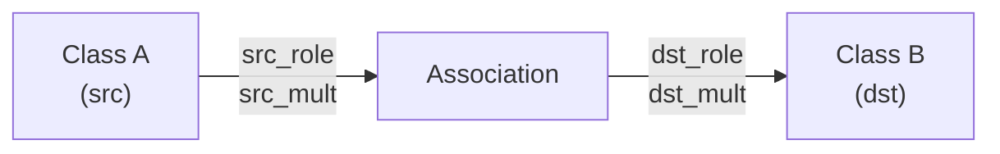
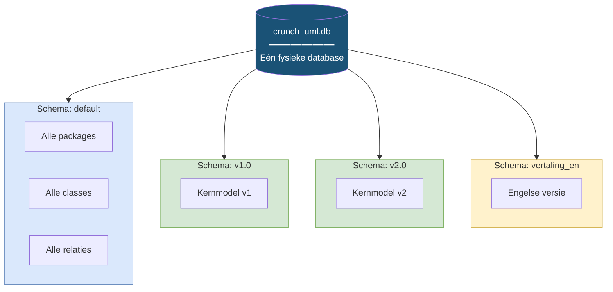

# Datamodel

## Entity-Relationship Diagram

```mermaid
erDiagram
    Package ||--o{ Package : "parent_package"
    Package ||--o{ Class : "bevat"
    Package ||--o{ Enumeratie : "bevat"
    Package ||--o{ Diagram : "bevat"

    Class ||--o{ Attribute : "heeft"
    Class ||--o{ Association : "src_class"
    Class ||--o{ Association : "dst_class"
    Class ||--o{ Generalization : "superclass"
    Class ||--o{ Generalization : "subclass"

    Enumeratie ||--o{ EnumerationLiteral : "heeft"
    Attribute |o--o| Enumeratie : "optioneel type"

    Diagram }o--o{ Class : "DiagramClass"
    Diagram }o--o{ Enumeratie : "DiagramEnumeration"
    Diagram }o--o{ Association : "DiagramAssociation"
    Diagram }o--o{ Generalization : "DiagramGeneralization"

    Package {
        string id PK
        string schema_id
        string name
        string parent_package_id FK
        string definitie
        string bron
        string toelichting
        string author
        string version
        string phase
        string status
        string uri
        string stereotype
        datetime created
        datetime modified
    }

    Class {
        string id PK
        string schema_id
        string name
        string package_id FK
        boolean is_datatype
        string definitie
        string bron
        string toelichting
        string author
        string version
        string phase
        string status
        string uri
        string stereotype
    }

    Attribute {
        string id PK
        string schema_id
        string name
        string clazz_id FK
        string primitive
        string enumeratie_id FK
        string definitie
        string bron
        string toelichting
    }

    Association {
        string id PK
        string schema_id
        string name
        string src_class_id FK
        string dst_class_id FK
        string src_mult_start
        string src_mult_end
        string dst_mult_start
        string dst_mult_end
        string src_role
        string dst_role
        string src_documentation
        string dst_documentation
    }

    Generalization {
        string id PK
        string schema_id
        string name
        string superclass_id FK
        string subclass_id FK
    }

    Enumeratie {
        string id PK
        string schema_id
        string name
        string package_id FK
        string definitie
        string bron
    }

    EnumerationLiteral {
        string id PK
        string schema_id
        string name
        string enumeratie_id FK
    }

    Diagram {
        string id PK
        string schema_id
        string name
        string package_id FK
    }

    DiagramClass {
        string diagram_id PK
        string schema_id PK
        string class_id PK
        float x
        float y
        float width
        float height
        int z_order
        text ea_style
    }

    DiagramAssociation {
        string diagram_id PK
        string schema_id PK
        string association_id PK
        text waypoints
        boolean hidden
        text ea_geometry
        text ea_style
    }
```

## Modeldetail

### Package

Container voor classes en enumerations. Packages vormen een hiërarchie via self-referencing `parent_package_id`.

**Belangrijke methoden**:

- `get_classes()` — Alle classes in dit package
- `get_enumerations()` — Alle enumeraties
- `is_model()` — Is dit een top-level model package?
- `get_classes_in_model()` — Alle classes recursief in de hiërarchie
- `get_copy()` — Deep copy van het package en alle children

### Class

UML Class entiteit met attributen en relaties.

**Relaties**:

- `package` — Bovenliggend package
- `attributes` — 1:N relatie met Attribute
- `uitgaande_associaties` — Associaties waar deze class de bron is
- `inkomende_associaties` — Associaties waar deze class het doel is
- `superclasses` — Generalisaties als subclass
- `subclasses` — Generalisaties als superclass

**Belangrijke methoden**:

- `get_attribute_by_name()` — Zoek attribuut op naam
- `copy_attributes()` — Kopieer attributen naar andere class
- `get_copy()` — Deep copy inclusief attributen

### Attribute

Property van een Class. Kan een primitief type (`primitive` als string) of een verwijzing naar een Enumeratie hebben.

### Association

Bidirectionele relatie tussen twee Classes met multipliciteiten en rolnamen.



### Generalization

Inheritance-relatie tussen twee classes. Bevat een `materialize()` methode die attributen van de superclass naar de subclass kopieert.

### Enumeratie & EnumerationLiteral

Enumeratietype met benoemde waarden. EnumerationLiteral bevat de individuele waarden.

### Diagram

Visueel diagram dat via junction tables verwijst naar classes, enumeraties, associaties en generalisaties.

#### Diagram-geometrie

De vier junction tables bevatten naast de membership ook de layout van elementen op het diagram. Alle geometriekolommen zijn **nullable**: membership zonder bekende layout blijft geldig, en bestanden of databases van vóór deze kolommen blijven importeerbaar.

**Node-achtig** (`DiagramClass`, `DiagramEnumeration`):

| Kolom | Type | Betekenis |
|---|---|---|
| `x` | Float | linkerkant, canonieke coördinaten |
| `y` | Float | bovenkant, canonieke coördinaten |
| `width` | Float | breedte |
| `height` | Float | hoogte |
| `z_order` | Integer | stapelvolgorde (EA `seqno`/`Sequence`) |
| `ea_style` | Text | ruwe EA style-string, lossless bewaard voor round-trip |

**Edge-achtig** (`DiagramAssociation`, `DiagramGeneralization`):

| Kolom | Type | Betekenis |
|---|---|---|
| `waypoints` | Text (JSON) | `[{"x": .., "y": ..}, ...]` in canonieke coördinaten; lege lijst of NULL = geen tussenpunten |
| `hidden` | Boolean | EA `Hidden`-vlag |
| `ea_geometry` | Text | ruwe EA geometry-string (SX/SY/EX/EY/EDGE/labelposities/Path) — lossless |
| `ea_style` | Text | ruwe EA style-string — lossless |

**Canoniek coördinatenstelsel**: oorsprong linksboven, x naar rechts, y naar beneden, alle waarden positief. Alle conversies van en naar EA-conventies gebeuren in de parsers en renderers; de database bevat uitsluitend canonieke waarden. De EA-conventies (geverifieerd tegen echte bestanden):

- XMI-extension node-geometrie (`Left=..;Top=..;Right=..;Bottom=..;`) heeft **positieve** Top/Bottom: `x=Left`, `y=Top`, `width=Right-Left`, `height=Bottom-Top`.
- `t_diagramobjects` in een `.qea`-repository heeft **negatieve** RectTop/RectBottom: `x=RectLeft`, `y=-RectTop`, `width=RectRight-RectLeft`, `height=RectTop-RectBottom`.
- `Path=`-waypoints hebben in **beide** bronnen negatieve y; canonieke waypoints flippen het teken. XMI scheidt x:y-paren met `$`, de qea-kolom `Path` met `;`.

#### Dekkingsmatrix diagrammen

Welke parsers en renderers diagram-membership en geometrie lezen of schrijven:

| Component | Diagram-membership | Geometrie |
|---|---|---|
| `eaxmi` parser | leest | leest |
| `qea` parser | leest | leest |
| `xmi` parser (strict) | n.v.t. — strict XMI 2.1 bevat geen diagrammen | n.v.t. |
| `xmi` renderer | schrijft | schrijft |
| `json` parser/renderer | leest/schrijft | leest/schrijft |
| `csv` parser/renderer | leest/schrijft (bestand per koppeltabel) | leest/schrijft |
| `xlsx` parser/renderer | leest/schrijft (tabblad per koppeltabel) | leest/schrijft |
| `i18n` parser/renderer | n.v.t. — koppeltabellen hebben geen `id`-kolom en bevatten niets vertaalbaars | n.v.t. |
| `earepo`/`eamimrepo` renderer | schrijft (`t_diagramobjects`/`t_diagramlinks`: update, insert, delete) | schrijft |
| `sqla` renderer | n.v.t. — genereert code voor het gemodelleerde domein, niet voor diagrammen | n.v.t. |
| Semantische renderers (`jinja2`, `ggm_md`, `json_schema`, `plain_html`, `model_overview_md`, `er_diagram`, `openapi`, `ttl`, `rdf`, `json-ld`, `shex`, `profile`, `uml_mmd`, `model_stats_md`, `diff_md`) | n.v.t. — geometrie heeft geen betekenis in deze uitvoerformaten | n.v.t. |

## Mixin-structuur

Alle entiteiten delen velden via mixins:

| Mixin | Velden | Gebruikt door |
|---|---|---|
| `UML_Generic` | id, schema_id, name, definitie, bron, toelichting, created, modified, stereotype | Alle entiteiten |
| `UMLBase` | author, version, phase, status, uri, visibility, alias | Package, Class, Attribute, etc. |
| `UMLTagsClazz` | MIM-tags, GEMMA-tags, history indicators | Class |
| `UMLTagsAttr` | Attribuut-specifieke tags | Attribute |
| `UMLTagsAssoc` | Associatie-specifieke tags | Association |

## Schema-isolatie: hetzelfde model meerdere keren inlezen

Een van de krachtigste features van crunch_uml is dat je hetzelfde model meerdere keren kunt inlezen in **verschillende schema's** binnen dezelfde database. Alle tabellen bevatten een `schema_id` kolom die deze isolatie mogelijk maakt.

### Hoe werkt het?

Elk schema is als een apart "vakje" in de database. Wanneer je een model importeert of transformeert, geef je met `-sch` aan in welk schema de data terecht moet komen. Entiteiten in het ene schema zijn volledig gescheiden van entiteiten in het andere — ze leven naast elkaar in dezelfde database maar overlappen niet.



### Typische toepassingen

**Versievergelijking** — Lees twee versies van hetzelfde model in (elk in een eigen schema) en gebruik de `diff_md`-renderer om automatisch de verschillen te rapporteren:

```bash
# Versie 2.0 in default schema (al geïmporteerd)
crunch_uml transform -ttp copy -sch_to versie_2 -rt_pkg ROOT

# Versie 1.0 in apart schema
crunch_uml -sch v1_raw import -f model_v1.xmi -t eaxmi
crunch_uml transform -ttp copy -sch_from v1_raw -sch_to versie_1 -rt_pkg ROOT

# Genereer diff
crunch_uml -sch versie_1 export -t diff_md -f diff.md \
    --compare_schema_name versie_2 --compare_title "v1 → v2"
```

**Meertaligheid** — Kopieer het model naar een vertaalschema en importeer vertalingen erbij:

```bash
crunch_uml transform -ttp copy -sch_to vertaling_en -rt_pkg ROOT
crunch_uml -sch vertaling_en import -f translations.json -t i18n --language en
```

**Deelmodellen** — Kopieer alleen een specifiek package (en alles eronder) naar een werkschema:

```bash
crunch_uml transform -ttp copy -sch_to deelmodel -rt_pkg EAPK_SUBPACKAGE_ID
```

**Experimenteren** — Kopieer naar een testschema, experimenteer met materialisatie van inheritance, en exporteer — zonder het origineel aan te raken:

```bash
crunch_uml transform -ttp copy -sch_to experiment -rt_pkg ROOT -m_gen True
crunch_uml -sch experiment export -t xlsx -f experiment.xlsx
```

### Technische implementatie

De `Schema`-klasse in `schema.py` vormt de wrapper. Alle CRUD-operaties lopen via de Schema-klasse, die automatisch het `schema_id` filtert:

```python
schema = Schema(database, "mijn_schema")
schema.get_all_classes()       # Alleen classes uit "mijn_schema"
schema.save(obj)               # Schrijft met schema_id = "mijn_schema"
schema.clean()                 # Verwijdert alles in "mijn_schema"
```

Omdat `schema_id` op **elke** tabel zit (packages, classes, attributes, associations, generalizations, enumerations, diagrams), is de isolatie volledig. Er is geen risico dat data uit het ene schema het andere beïnvloedt.
