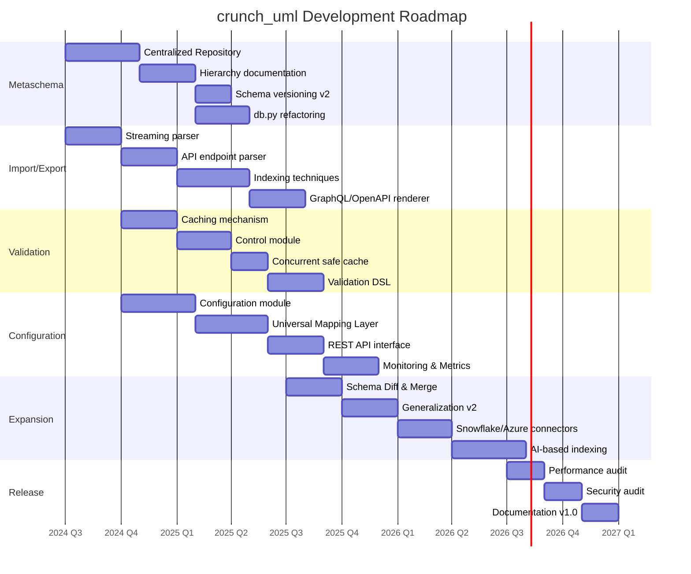

# Planned Components & Roadmap

## Roadmap Overview

---

## Phase 1: Metaschema & Import/Export

### Centralized Repository

Hierarchically documented and structured metaschema with unique identifiers for relationships. Minimizes parsing issues with deep nesting.

**Technical Challenge**: Inconsistencies between repository metaschema and actual metaschemas used in source systems.

- [ ] Hierarchical documentation of the metaschema
- [ ] Unique identifier management for relationships
- [ ] Version tracking and migration tooling

### Streaming / Chunked Parser

Processing of large XMI and JSON files in chunks to limit memory usage.

- [ ] Chunked XML parsing via `lxml.iterparse()`
- [ ] Streaming JSON via `ijson`
- [ ] Memory profiling and benchmarks

### API Endpoint Parser

Direct integration with external model repositories via REST APIs.

- [ ] Generic REST client
- [ ] Pagination support
- [ ] Authentication (OAuth2, API keys)

### Indexing Techniques

More efficient queries on large models.

- [ ] Full-text indexing via SQLAlchemy
- [ ] Fuzzy search (trigram-based)
- [ ] AI-based semantic indexing (embeddings)

---

## Phase 2: Validation & Configuration

### Caching & Validation Engine

Cache mechanism for stored validations so that not every validation has to run completely from scratch.

**Technical Challenge**: Concurrency issues when validating and updating the cache simultaneously.

- [ ] Validation result caching (hash-based)
- [ ] Cache invalidation on model changes
- [ ] Concurrent-safe locking strategy
- [ ] Control module for managing cached results

### Universal Mapping Layer

Metadata-driven, database-agnostic mapping intermediate layer.

**Technical Challenge**: Complexity of mapping configuration with extensive metadata. Variations in inheritance interpretation.

- [ ] Mapping DSL or configuration format
- [ ] Standard inheritance strategies (table-per-class, table-per-hierarchy, etc.)
- [ ] Database dialect abstraction
- [ ] Reverse engineering from existing databases

### Configuration Module

Overarching interface for managing data exchanges and the logging process.

- [ ] Pipeline configuration (YAML/TOML)
- [ ] Audit logging of all operations
- [ ] Reproducible transformation runs
- [ ] Environment-specific configuration

### REST API Interface

FastAPI-based web interface.

- [ ] Endpoints for import/transform/export
- [ ] Async processing of large files
- [ ] WebSocket for progress updates
- [ ] OpenAPI documentation (auto-generated)

---

## Phase 3: Expansion

### Schema Diff & Merge Engine

Automatic comparison and merging of two schema versions.

- [ ] Structural diff (packages, classes, attributes)
- [ ] Semantic diff (relationships, constraints)
- [ ] Three-way merge
- [ ] Conflict resolution UI/CLI

### Generalization Materializer v2

Support for complex inheritance strategies.

- [ ] Multi-level inheritance
- [ ] Diamond inheritance handling
- [ ] Configurable materialization strategies
- [ ] Impact analysis for structural changes

### GraphQL / OpenAPI Renderers

- [ ] GraphQL schema generation
- [ ] OpenAPI/Swagger specifications
- [ ] Type mapping configuration

### Cloud Database Connectors

- [ ] Snowflake connector
- [ ] Azure SQL Database connector
- [ ] Connection pooling and retry logic

### Monitoring & Metrics

- [ ] Performance metrics per operation
- [ ] Memory usage tracking
- [ ] Operation logging with timing
- [ ] Dashboard / reporting interface

---

## Ongoing Activities

| Activity | Tooling |
|---|---|
| Code quality | black, isort, mypy, flake8, bandit |
| Testing | pytest, pytest-cov |
| CI/CD | GitHub Actions |
| Packaging | build, twine → PyPI |
| Documentation | mkdocs-material |
