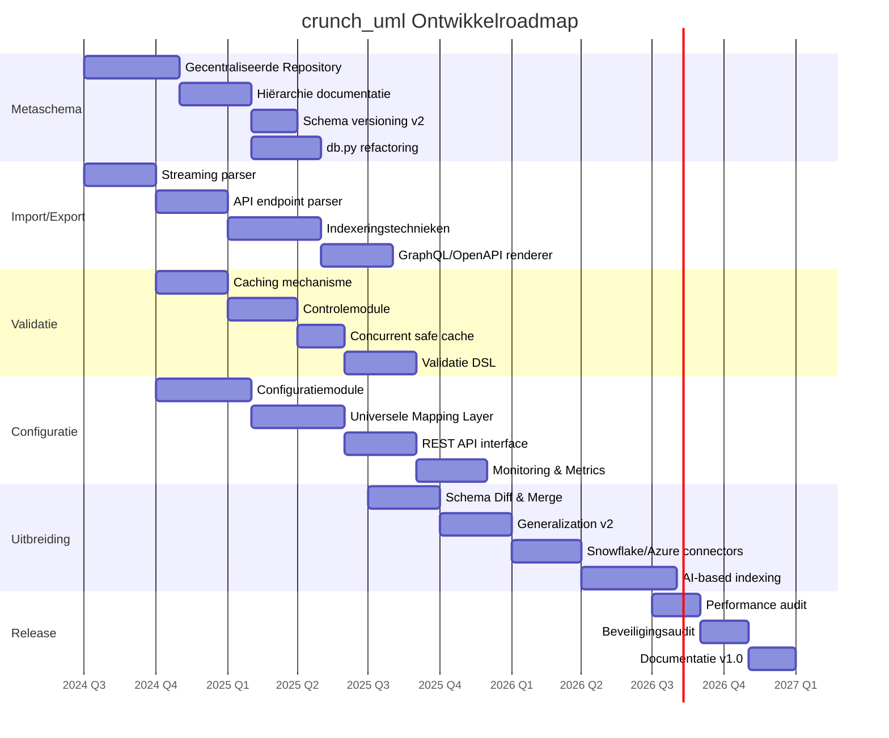

# Beoogde Componenten & Roadmap

## Roadmap Overzicht

---

## Fase 1: Metaschema & Import/Export

### Gecentraliseerde Repository

Hiërarchisch gedocumenteerd en gestructureerd metaschema met unique identifiers voor relaties. Minimaliseert parsing issues bij diepe nesting.

**Technische uitdaging**: Inconsistenties tussen repository-metaschema en werkelijk gebruikte metaschema's in bronsystemen.

- [ ] Hiërarchische documentatie van het metaschema
- [ ] Unique identifier management voor relaties
- [ ] Versie-tracking en migratie-tooling

### Streaming / Chunked Parser

Verwerking van grote XMI- en JSON-bestanden in chunks om geheugengebruik te beperken.

- [ ] Chunked XML parsing via `lxml.iterparse()`
- [ ] Streaming JSON via `ijson`
- [ ] Memory profiling en benchmarks

### API Endpoint Parser

Directe integratie met externe model-repositories via REST API's.

- [ ] Generieke REST client
- [ ] Paginatie-ondersteuning
- [ ] Authentication (OAuth2, API keys)

### Indexeringstechnieken

Efficiëntere queries op grote modellen.

- [ ] Full-text indexing via SQLAlchemy
- [ ] Fuzzy search (trigram-gebaseerd)
- [ ] AI-gebaseerde semantic indexing (embeddings)

---

## Fase 2: Validatie & Configuratie

### Caching & Validatie Engine

Cache-mechanisme voor opgeslagen validaties zodat niet elke validatie volledig opnieuw hoeft te draaien.

**Technische uitdaging**: Concurrentieproblemen bij gelijktijdig valideren en bijwerken van de cache.

- [ ] Validatie-resultaat caching (hash-gebaseerd)
- [ ] Cache-invalidatie bij model-wijzigingen
- [ ] Concurrent-safe locking strategie
- [ ] Controlemodule voor beheer gecachte resultaten

### Universele Mapping Layer

Metadata-driven, database-agnostic mapping tussenlaag.

**Technische uitdaging**: Complexiteit mapping-configuratie bij uitgebreide metagegevens. Variaties in inheritance-interpretatie.

- [ ] Mapping DSL of configuratieformaat
- [ ] Standaard inheritance-strategieën (table-per-class, table-per-hierarchy, etc.)
- [ ] Database-dialect abstractie
- [ ] Reverse engineering vanuit bestaande databases

### Configuratiemodule

Overkoepelende interface voor beheer van data exchanges en het loggingproces.

- [ ] Pipeline-configuratie (YAML/TOML)
- [ ] Audit logging van alle operaties
- [ ] Reproduceerbare transformatie-runs
- [ ] Environment-specifieke configuratie

### REST API Interface

FastAPI-gebaseerde web-interface.

- [ ] Endpoints voor import/transform/export
- [ ] Async verwerking van grote bestanden
- [ ] WebSocket voor progress updates
- [ ] OpenAPI documentatie (auto-gegenereerd)

---

## Fase 3: Uitbreiding

### Schema Diff & Merge Engine

Automatische vergelijking en samenvoeging van twee schema-versies.

- [ ] Structural diff (packages, classes, attributes)
- [ ] Semantic diff (relaties, constraints)
- [ ] Three-way merge
- [ ] Conflict resolution UI/CLI

### Generalization Materializer v2

Ondersteuning voor complexe inheritance-strategieën.

- [ ] Multi-level inheritance
- [ ] Diamond inheritance handling
- [ ] Configurable materialization strategies
- [ ] Impact-analyse bij structuurwijzigingen

### GraphQL / OpenAPI Renderers

- [ ] GraphQL schema generatie
- [ ] OpenAPI/Swagger specificaties
- [ ] Type mapping configuratie

### Cloud Database Connectors

- [ ] Snowflake connector
- [ ] Azure SQL Database connector
- [ ] Connection pooling en retry-logica

### Monitoring & Metrics

- [ ] Performance metrics per operatie
- [ ] Memory usage tracking
- [ ] Operatie-logging met timing
- [ ] Dashboard / reporting interface

---

## Doorlopende activiteiten

| Activiteit | Tooling |
|---|---|
| Code quality | black, isort, mypy, flake8, bandit |
| Testing | pytest, pytest-cov |
| CI/CD | GitHub Actions |
| Packaging | build, twine → PyPI |
| Documentatie | mkdocs-material |
