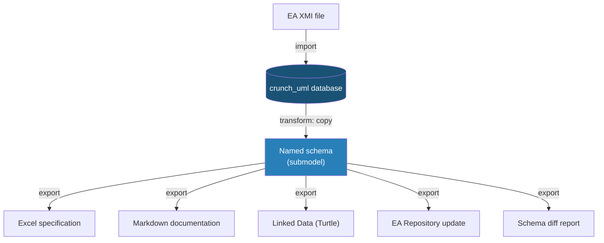
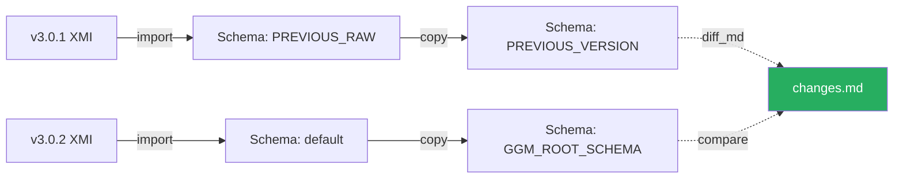
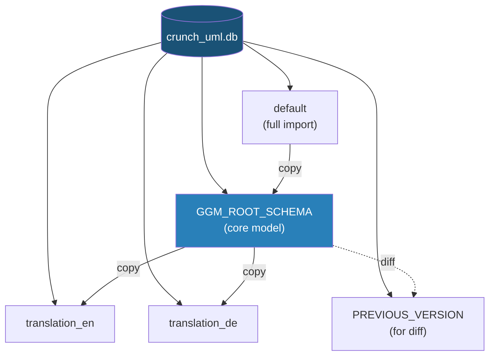

# Examples

This page shows concrete workflows from practice. The examples are based on the automated deployment pipeline for the Municipal Data Model (GGM), but the patterns are applicable to any UML model.

## Workflow Overview



---

## Example 1: Import model and extract submodel

The most common pattern: import a large model, then copy only the relevant part to a working schema.

```bash
# Step 1: Import the complete EA XMI file into a new database
crunch_uml import -f ./v3.0.2/GGM_EA_XMI.xmi -t eaxmi -db_create

# Step 2: Copy only the core model to a named schema
crunch_uml transform -ttp copy \
    -sch_to GGM_ROOT_SCHEMA \
    -rt_pkg EAPK_GUID_OF_ROOT_PACKAGE
```

**What happens here?**

- Step 1 reads the complete XMI file and stores all packages, classes, attributes, associations and generalizations in the `default` schema of the database.
- Step 2 makes a deep copy of only the root package (and all underlying packages) to a separate schema. This separates the core model from any auxiliary packages or metadata.

---

## Example 2: Generate Excel specification

Export the model as an Excel file with tabs for each entity (packages, classes, attributes, etc.).

```bash
crunch_uml -sch GGM_ROOT_SCHEMA export \
    -t xlsx \
    -f ./v3.0.2/GGM_Specification.xlsx
```

This produces an Excel file with worksheets for `packages`, `classes`, `attributes`, `enumerations`, `enumerationliterals`, `associations` and `generalizations`.

---

## Example 3: Generate Markdown documentation

Generate human-readable documentation based on a Jinja2 template:

```bash
# Create the docs directory
mkdir -p ./docs/definitions

# Generate markdown with a custom template
crunch_uml -sch GGM_ROOT_SCHEMA export \
    -t jinja2 \
    --output_jinja2_template ggm_markdown.j2 \
    -f ./docs/definitions/definition.md \
    --output_jinja2_templatedir ./tools/
```

The Jinja2 renderer creates one file per *model* (a package that contains at least one Class). The template determines the formatting.

---

## Example 4: Export Linked Data (Turtle)

Generate an RDF/OWL ontology in Turtle format:

```bash
crunch_uml -sch GGM_ROOT_SCHEMA export \
    -t ttl \
    -f ./v3.0.2/GGM_Ontology.ttl \
    --linked_data_namespace https://modellen.geostandaarden.nl/def/ggm/
```

The `--linked_data_namespace` argument determines the base URI for all generated RDF resources.

---

## Example 5: Compare versions (schema diff)

Import two versions of the same model and generate a difference report:

```bash
# Step 1: Import the current version (already in the database)
# (see Example 1)

# Step 2: Import the previous version in a separate schema
crunch_uml -sch PREVIOUS_RAW import \
    -f ./v3.0.1/GGM_EA_XMI.xmi \
    -t eaxmi

# Step 3: Copy the core model of the previous version
crunch_uml transform -ttp copy \
    -sch_from PREVIOUS_RAW \
    -sch_to PREVIOUS_VERSION \
    -rt_pkg EAPK_GUID_OF_ROOT_PACKAGE

# Step 4: Generate the diff report
crunch_uml -sch PREVIOUS_VERSION export \
    -t diff_md \
    -f ./v3.0.2/changes.md \
    --compare_schema_name GGM_ROOT_SCHEMA \
    --compare_title "Changes from v3.0.1 to v3.0.2"
```

**What happens here?**



By loading both versions in separate schemas within the same database, crunch_uml can compare them element by element and produce a markdown report with all differences.

---

## Example 6: Generate multilingual model

Translate a model into multiple languages and write the translations back to EA repositories:

```bash
# For each language (e.g. English and German):
for LANG in en de; do
    SCHEMA="translation_${LANG}"

    # Step 1: Copy the base model to a translation schema
    crunch_uml transform -ttp copy \
        -sch_to $SCHEMA \
        --root_package EAPK_GUID_OF_ROOT

    # Step 2: Import existing translations
    crunch_uml -sch $SCHEMA import \
        -f ./translations/translations.json \
        -t i18n \
        --language $LANG

    # Step 3: Copy the translated EA file and update it
    cp -f ./model.qea "./translations/GGM_${LANG}.qea"
    crunch_uml -sch $SCHEMA export \
        -f "./translations/GGM_${LANG}.qea" \
        -t earepo \
        --tag_strategy update
done
```

---

## Example 7: Generate i18n translations

Automatically generate translations from Dutch to other languages:

```bash
# Export translatable fields in i18n format with automatic translation
crunch_uml -sch GGM_ROOT_SCHEMA export \
    -t i18n \
    -f ./translations/translations.json \
    --language en \
    --translate True \
    --from_language nl
```

This exports all translatable fields (`name`, `definition`, `explanation`, `alias`, etc.) and translates them automatically to English.

---

## Example 8: CSV export for GEMMA

Export specific entities as CSV with custom column names (for upload in an external system):

```bash
mkdir -p ./gemma

# Export classes with column mapping
crunch_uml -sch GGM_ROOT_SCHEMA export \
    -t csv \
    -f ./gemma/gemma_export \
    --mapper '{"name": "Name", "definition": "Description", "stereotype": "Type"}' \
    --entity_name classes

# Export associations
crunch_uml -sch GGM_ROOT_SCHEMA export \
    -t csv \
    -f ./gemma/gemma_export \
    --mapper '{"name": "Name", "definition": "Description"}' \
    --entity_name associations

# Export packages
crunch_uml -sch GGM_ROOT_SCHEMA export \
    -t csv \
    -f ./gemma/gemma_export \
    --entity_name packages
```

---

## Example 9: Update EA Repository with MIM tags

Update an Enterprise Architect repository with MIM (Metamodel Information Modeling) tags:

```bash
crunch_uml -sch GGM_ROOT_SCHEMA export \
    -t eamimrepo \
    -f ./model.qea \
    --tag_strategy upsert
```

The `upsert` strategy adds new tags and updates existing ones, without deleting unmentioned tags.

---

## Example 10: Complete deployment pipeline

Combine all steps in an automated pipeline (with [Task](https://taskfile.dev/)):

```bash
# Complete deployment in one command
task full-deploy
```

This executes in sequence:

1. `generate-excel` — Excel specification
2. `generate-translations` — Multilingual translations
3. `deploy-docs` — Build and deploy MkDocs documentation
4. `generate-lod` — Linked Data export
5. `generate-mim` — MIM version
6. `generate-diff-md` — Difference report with previous version

!!! tip "Taskfile"
    See the `TaskFile.yml` in the repository for a complete worked-out pipeline that automates all these steps, including validation of requirements and version control.

---

## Schema Strategy Summary

An overview of the schemas used in a typical workflow:

| Schema | Content | Purpose |
|---|---|---|
| `default` | Fully imported model | Raw import |
| `GGM_ROOT_SCHEMA` | Core model (copied submodel) | Basis for all exports |
| `PREVIOUS_VERSION` | Previous version of the model | Comparison / diff |
| `translation_en` | English version | Multilinguality |
| `translation_de` | German version | Multilinguality |


