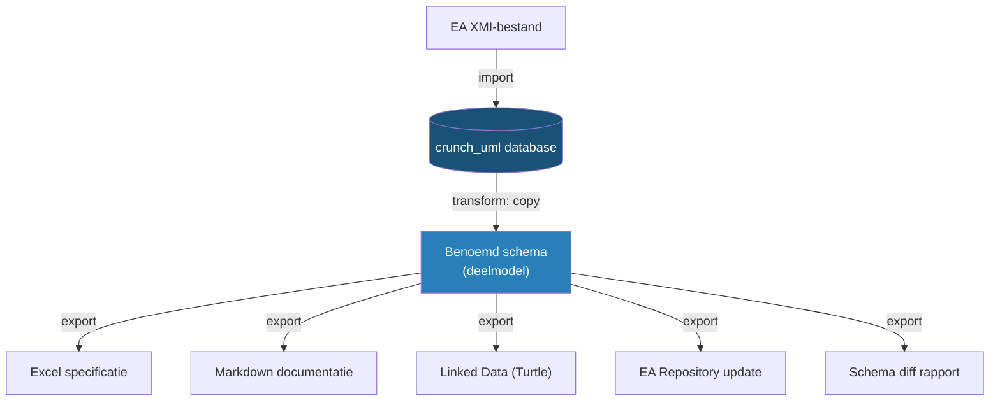
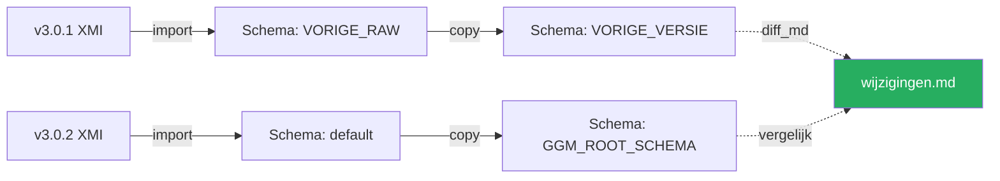
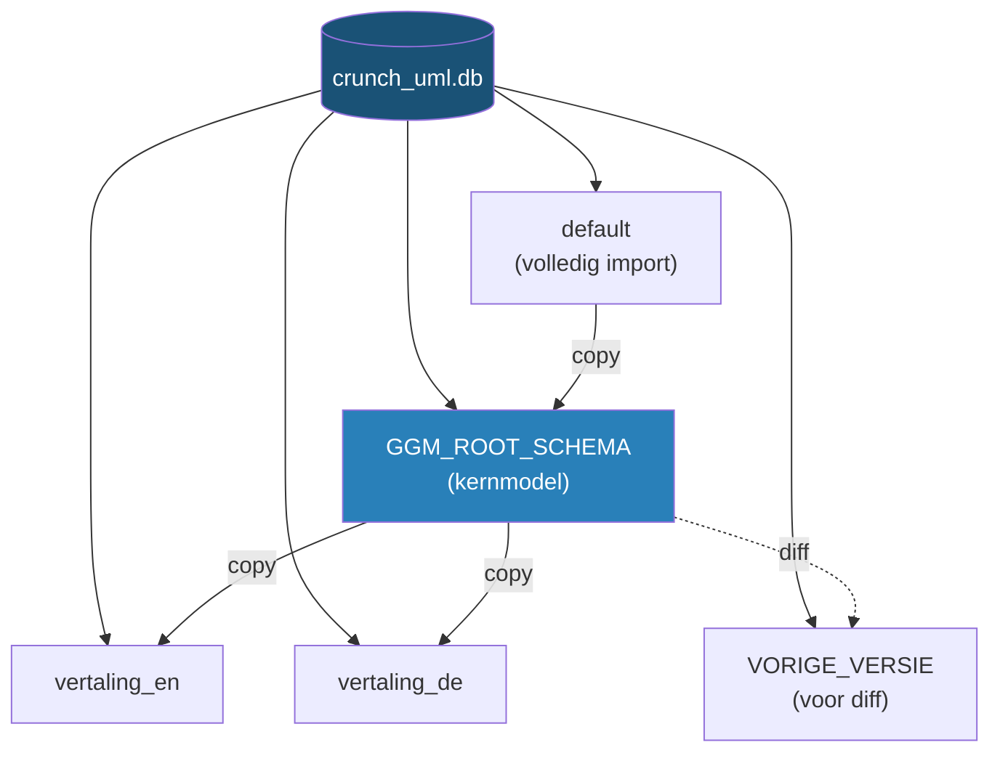

# Voorbeelden

Deze pagina toont concrete workflows uit de praktijk. De voorbeelden zijn gebaseerd op de geautomatiseerde deployment-pipeline voor het Gemeentelijk Gegevensmodel (GGM), maar de patronen zijn toepasbaar op elk UML-model.

## Werkwijze overzicht



---

## Voorbeeld 1: Model importeren en deelmodel extraheren

Het meest voorkomende patroon: een groot model importeren, en vervolgens alleen het relevante deel kopiëren naar een werkschema.

```bash
# Stap 1: Importeer het volledige EA XMI-bestand in een nieuwe database
crunch_uml import -f ./v3.0.2/GGM_EA_XMI.xmi -t eaxmi -db_create

# Stap 2: Kopieer alleen het kernmodel naar een benoemd schema
crunch_uml transform -ttp copy \
    -sch_to GGM_ROOT_SCHEMA \
    -rt_pkg EAPK_GUID_VAN_ROOT_PACKAGE
```

**Wat gebeurt hier?**

- Stap 1 leest het volledige XMI-bestand in en slaat alle packages, classes, attributen, associaties en generalisaties op in de `default`-schema van de database.
- Stap 2 maakt een deep copy van alleen het root-package (en alle onderliggende packages) naar een apart schema. Dit scheidt het kernmodel van eventuele hulp-packages of metadata.

---

## Voorbeeld 2: Excel-specificatie genereren

Exporteer het model als een Excel-bestand met tabs voor elke entiteit (packages, classes, attributen, etc.).

```bash
crunch_uml -sch GGM_ROOT_SCHEMA export \
    -t xlsx \
    -f ./v3.0.2/GGM_Specificatie.xlsx
```

Dit produceert een Excel-bestand met worksheets voor `packages`, `classes`, `attributes`, `enumerations`, `enumerationliterals`, `associations` en `generalizations`.

---

## Voorbeeld 3: Markdown-documentatie genereren

Genereer mensleesbare documentatie op basis van een Jinja2-template:

```bash
# Maak de docs-directory aan
mkdir -p ./docs/definities

# Genereer markdown met een custom template
crunch_uml -sch GGM_ROOT_SCHEMA export \
    -t jinja2 \
    --output_jinja2_template ggm_markdown.j2 \
    -f ./docs/definities/definitie.md \
    --output_jinja2_templatedir ./tools/
```

De Jinja2-renderer maakt één bestand per *model* (een package dat minimaal één Class bevat). Het template bepaalt de opmaak.

---

## Voorbeeld 4: Linked Data (Turtle) exporteren

Genereer een RDF/OWL-ontologie in Turtle-formaat:

```bash
crunch_uml -sch GGM_ROOT_SCHEMA export \
    -t ttl \
    -f ./v3.0.2/GGM_Ontologie.ttl \
    --linked_data_namespace https://modellen.geostandaarden.nl/def/ggm/
```

Het `--linked_data_namespace` argument bepaalt de base URI voor alle gegenereerde RDF-resources.

---

## Voorbeeld 5: Versies vergelijken (schema diff)

Importeer twee versies van hetzelfde model en genereer een verschilrapport:

```bash
# Stap 1: Importeer de huidige versie (staat al in de database)
# (zie Voorbeeld 1)

# Stap 2: Importeer de vorige versie in een apart schema
crunch_uml -sch VORIGE_RAW import \
    -f ./v3.0.1/GGM_EA_XMI.xmi \
    -t eaxmi

# Stap 3: Kopieer het kernmodel van de vorige versie
crunch_uml transform -ttp copy \
    -sch_from VORIGE_RAW \
    -sch_to VORIGE_VERSIE \
    -rt_pkg EAPK_GUID_VAN_ROOT_PACKAGE

# Stap 4: Genereer het diff-rapport
crunch_uml -sch VORIGE_VERSIE export \
    -t diff_md \
    -f ./v3.0.2/wijzigingen.md \
    --compare_schema_name GGM_ROOT_SCHEMA \
    --compare_title "Wijzigingen van v3.0.1 naar v3.0.2"
```

**Wat gebeurt hier?**



Door beide versies in aparte schema's binnen dezelfde database te laden, kan crunch_uml ze element voor element vergelijken en een markdown-rapport produceren met alle verschillen.

---

## Voorbeeld 6: Meertalig model genereren

Vertaal een model naar meerdere talen en schrijf de vertalingen terug naar EA-repositories:

```bash
# Voor elke taal (bijv. Engels en Duits):
for LANG in en de; do
    SCHEMA="vertaling_${LANG}"

    # Stap 1: Kopieer het basismodel naar een vertaalschema
    crunch_uml transform -ttp copy \
        -sch_to $SCHEMA \
        --root_package EAPK_GUID_VAN_ROOT

    # Stap 2: Importeer bestaande vertalingen
    crunch_uml -sch $SCHEMA import \
        -f ./vertalingen/translations.json \
        -t i18n \
        --language $LANG

    # Stap 3: Kopieer het vertaalde EA-bestand en werk het bij
    cp -f ./model.qea "./vertalingen/GGM_${LANG}.qea"
    crunch_uml -sch $SCHEMA export \
        -f "./vertalingen/GGM_${LANG}.qea" \
        -t earepo \
        --tag_strategy update
done
```

---

## Voorbeeld 7: i18n-vertalingen genereren

Genereer automatisch vertalingen vanuit het Nederlands naar andere talen:

```bash
# Exporteer vertaalbare velden naar i18n-formaat met automatische vertaling
crunch_uml -sch GGM_ROOT_SCHEMA export \
    -t i18n \
    -f ./vertalingen/translations.json \
    --language en \
    --translate True \
    --from_language nl
```

Dit exporteert alle vertaalbare velden (`name`, `definitie`, `toelichting`, `alias`, etc.) en vertaalt ze automatisch naar Engels.

---

## Voorbeeld 8: CSV-export voor GEMMA

Exporteer specifieke entiteiten als CSV met aangepaste kolomnamen (voor upload in een extern systeem):

```bash
mkdir -p ./gemma

# Exporteer classes met kolom-mapping
crunch_uml -sch GGM_ROOT_SCHEMA export \
    -t csv \
    -f ./gemma/gemma_export \
    --mapper '{"name": "Naam", "definitie": "Beschrijving", "stereotype": "Type"}' \
    --entity_name classes

# Exporteer associations
crunch_uml -sch GGM_ROOT_SCHEMA export \
    -t csv \
    -f ./gemma/gemma_export \
    --mapper '{"name": "Naam", "definitie": "Beschrijving"}' \
    --entity_name associations

# Exporteer packages
crunch_uml -sch GGM_ROOT_SCHEMA export \
    -t csv \
    -f ./gemma/gemma_export \
    --entity_name packages
```

---

## Voorbeeld 9: EA Repository bijwerken met MIM-tags

Werk een Enterprise Architect repository bij met MIM (Metamodel Informatiemodellering) tags:

```bash
crunch_uml -sch GGM_ROOT_SCHEMA export \
    -t eamimrepo \
    -f ./model.qea \
    --tag_strategy upsert
```

De `upsert`-strategie voegt nieuwe tags toe en werkt bestaande bij, zonder niet-genoemde tags te verwijderen.

---

## Voorbeeld 10: Volledige deployment-pipeline

Combineer alle stappen in een geautomatiseerde pipeline (met [Task](https://taskfile.dev/)):

```bash
# Volledige deployment in één commando
task full-deploy
```

Dit voert achtereenvolgens uit:

1. `generate-excel` — Excel-specificatie
2. `generate-translations` — Meertalige vertalingen
3. `deploy-docs` — MkDocs documentatie bouwen en deployen
4. `generate-lod` — Linked Data export
5. `generate-mim` — MIM-versie
6. `generate-diff-md` — Verschilrapport met vorige versie

!!! tip "Taskfile"
    Bekijk het `TaskFile.yml` in de repository voor een volledig uitgewerkte pipeline die al deze stappen automatiseert, inclusief validatie van vereisten en versiebeheer.

---

## Schema-strategie samenvatting

Een overzicht van de schema's die in een typische workflow worden gebruikt:

| Schema | Inhoud | Doel |
|---|---|---|
| `default` | Volledig geïmporteerd model | Ruwe import |
| `GGM_ROOT_SCHEMA` | Kernmodel (gekopieerd deelmodel) | Basis voor alle exports |
| `VORIGE_VERSIE` | Vorige versie van het model | Vergelijking / diff |
| `vertaling_en` | Engelstalige versie | Meertaligheid |
| `vertaling_de` | Duitstalige versie | Meertaligheid |


